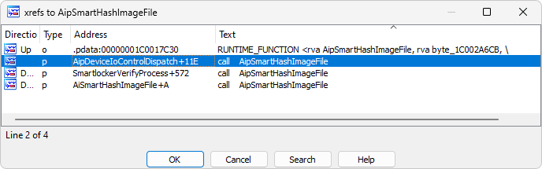

## Giới thiệu
**CVE 2024-21338** (CVSS Score: 8.8) nằm trong cơ chế xử lý IOCTL `0x22A018` của driver `appid.sys`. Khi nhận yêu cầu IOCTL này, hàm AipSmartHashImageFile() được kích hoạt để tính toán hash của file thực thi, nhưng cho phép kẻ tấn công kiểm soát hai con trỏ callback. Điều này dẫn đến khả năng ghi đè bộ nhớ kernel và tiềm ẩn rủi ro leo thang đặc quyền.
## Phân tích driver appid.sys và vai trò của IOCTL
> **Note:** 
> - **appid.sys**: *là trình điều khiển cung cấp khả năng kiểm soát ứng dụng trong AppLocker, nhằm ngăn chặnthực thi các ứng dụng không được phép. Tuy nhiên, lỗ hổng tồn tại trong cách mà driver xử lý mã IOCTL `0x22A018`, sử dụng để tính toán **smart hash** của file thực thi.*
> - **IOCTL (Input/Output Control)**: *là cơ chế cho phép ứng dụng người dùng giao tiếp với trình điều khiển kernel bằng cách gửi các yêu cầu cụ thể. Trong trường hợp này, IOCTL `0x22A018` cho phép chỉ định các con trỏ hàm để xử lý file, bao gồm truy vấn kích thước file và đọc dữ liệu từ file.*

Để giao tiếp với driver thông qua IOCTL trên Windows, bước đầu tiên cần có handle để mở driver. Thông qua phân tích appid.sys(AppLocker) driver bằng IDA Pro, trong hàm DriverEntry xác định object cần mở để handle là `"\\Device\\AppID"`.

Hàm **AipSmartHashImageFile()** có vai trò chính trong việc tính toán "smart hash" của một file thực thi. Cụ thể, nó được gọi bởi driver **appid.sys** của Windows khi nhận yêu cầu IOCTL `0x22A018`. Cơ chế hoạt động của hàm dựa trên hai callback function được truyền vào thông qua  bộ nhớ đệm đầu vào.
Về căn bản, driver xử lý các IOCTL trong các hàm tương tự như sau:
```c
NTSTATUS DeviceControl(_In_ PDEVICE_OBJECT DeviceObject, _In_ PIRP Irp)
{
    PIO_STACK_LOCATION stack = IoGetCurrentIrpStackLocation(Irp);
    ULONG ioctlCode = stack->Parameters.DeviceIoControl.IoControlCode;
    switch (ioctlCode) {
        // Xử lý từng mã IOCTL
    }
}
```
Khi nhận được yêu cầu IOCTL, hàm `DeviceControl` được gọi với các tham số **DeviceObject** và **Irp**. Hàm này sẽ lấy mã IOCTL từ stack để xử lý.

IOCTL sẽ được xử lý qua hàm `AipDeviceIoControlDispath` và sau đó chuyển tiếp đến hàm `AipSmartHashImageFile` để thực hiện tính toán hash.

Khi trace ngược các lệnh gọi đến `AipSmartHashImageFile`, ta thấy luồng xử lý đi qua 2 hàm sau:
- `SmartLockerVerifyProcess`: Đây là hàm của Windows Applocker dùng để xác minh tính hợp lệ của process trước khi cho phép thực thi. Hàm này thực hiện kiểm tra process dựa trên các quy tắc bảo mật đã thiết lập, đảm bảo chỉ các ứng dụng được uỷ quyền mới được phép chạy và xác thực tính toàn vẹn của file thực thi.
- `AipDeviceIoControlDispatch`: trong quá trình phân tích code của hàm AipDeviceIoControlDispatch, ta có thể thấy format code khá tương đồng với code mẫu đã đề cập ở trên, từ đó có thể xác định đây chính là hàm dùng để xử lý các IOCTL(handle các IOCTL call của driver thông qua Device handle). Khi IOCTL code `0x22A018` được gọi, hàm `AipSmartHashImageFile` sẽ được thực thi với các tham số ConfigOptions được truyền vào.

Ta có thể thấy hàm `AipSmartHashImageFile` được call tại IOCTL code là `0x22A018`.
Bên cạnh đó, để gửi một yêu cầu điều khiển tới hàm `NtDeviceIoControl` cần có struct IOCTL riêng.
> Dựa trên tài liệu về IOCTL của Microsoft, để xử lý driver cần có quyền **FILE_WRITE_ACCESS**(với IOCTL code 0x0002). Để xác định user nào có quyền này trên AppID device, chúng ta tiến hành phân tích thông qua công cụ **WinObj** thuộc bộ **SysInternalsSuites**. Công cụ này cho phép liệt kê toàn bộ system object, bao gồm device và driver trong hệ thống.
Kết quả kiểm tra **ACL (Access Control List)** của AppID device cho thấy ngay cả nhóm `Administrators` cũng không được cấp quyền `Write`.

Qua kiểm tra bằng công cụ **WinObj**, phát hiện `LOCAL SERVICE` có đầy đủ quyền truy cập **(Read, Write, Delete và Special permissions)** trên AppID device. Đặc quyền này cho phép thực hiện truy cập và gọi đến hàm mong muốn thông qua IOCTL code.

**Wrapup**: Từ những phân tích trên, lỗ hổng có thể được khai thác thông qua việc lợi dụng **Windows Access Token** bằng kỹ thuật Token impersonation và truyền payload tới hàm `AipSmartHashImageFile`. Đây chính là vector tấn công chính để thực hiện leo thang đặc quyền trong hệ thống.
## Khai thác
Để thực hiện khai thác, cần truy cập vào `"\\Device\\AppID"` bằng user `LOCAL SERVICE` thông qua kỹ thuật Access Token impersonation.
> **Note:** *Theo tài liệu Microsoft, Windows Access Token là một object đại diện cho security context của process hoặc thread. Token này chứa thông tin về khả năng nhận dạng và quyền hạn của user account được gắn với process/thread tương ứng. Khi người dùng đăng nhập, hệ thống sẽ xác thực bằng cách so sánh thông tin với database và tạo access token. Mỗi process thực thi dưới user đó sẽ nhận được bản copy của token này.*

Access token có thể được sao chép từ remote process trong Windows (với điều kiện có đủ quyền hạn). Quá trình leo thang từ `Administrator` lên `NT AUTHORITY\SYSTEM` (S-1-5-18) yêu cầu hai quyền đặc biệt:`SeDebugPrivilege` và `SeAssignPrimaryTokenPrivilege`.

Process **winlogon.exe** được chạy với quyền **SYSTEM** để quản lý trạng thái đăng nhập Windows, do đó nó sở hữu cả hai quyền trên và cho phép người dùng tương tác. Đặc biệt, process này còn cho phép duplicate `NT AUTHORITY\SYSTEM` access token từ process này.

Tiếp theo quá trình khai thác, sau khi sao chép **SYSTEM** token thông qua WinAPI `DuplicateTokenEx`, có thể truy cập vào `NT AUTHORITY\LOCAL SERVICE`(S-1-5-19) access token bằng cách tìm các token có hai quyền đặc biệt:  `SeDebugPrivilege` và `SeImpersonatePrivilege`. 

Process **svhost.exe** thường được chạy dưới quyền `NT AUTHORITY\LOCAL SERVICE`.

-> Là một đối tượng lý tưởng để khai thác.

Với quyền truy cập `NT AUTHORITY\LOCAL SERVICE`, đồng nghĩa với việc có quyền **Write** vào  `"\\Device\\AppID"` và có thể sử dụng IOCTL code `0x22A018`. Điều này cho phép mở handle và truy cập vào hàm `AipSmartHashImageFile`, từ đó có thể gửi payload để trigger *PreviousMode* bị memory corrupt.
> **Note**: *PreviousMode là một trường trong struct _KTHREAD, được sử dụng để đánh dấu syscall được gọi từ KernelMode hay UserMode. Một số syscall như Nt hoặc Zw(direct) sẽ kiểm tra giá trị PreviousMode bằng cách check PreviousMode của thread hiện tại.*


**Ví dụ**: Khi gọi syscall `NtWriteVirtualMemory` trong `ntoskrnl.exe`, chương trình sẽ thực hiện gọi đến hàm `MiReadWriteVirtualMemory`, có thể xác nhận thông qua phân tích disassemble của hàm này.

Nhìn vào disassemble của hàm `MiReadWriteVirtualMemory`

Ta có thể thấy đoạn kiểm tra giá trị của **PreviousMode** từ dòng 32 tới 35.
Chuỗi gọi hàm khi thực hiện khai thác:

Trong đó, hàm `AppHashComputeImageHashInternal` sẽ thực thi function pointer được control bởi user dựa trên buffer đã được control bởi user. Việc thực thi này được kích hoạt thông qua IOCTL `0x22A018`.


=> Với khả năng kiểm soát function pointer trong hàm `AipSmartHashImageFile`, một hướng khai thác tiềm năng là gửi user-mode shellcode tới control code và sửa đổi giá trị **PreviousMode** của thread hiện tại về 0. Tuy nhiên, hai cơ chế bảo mật quan trọng của Windows đó chính là **kCFG(Kernel Control Flow Guard)** và **SMEP(Supervisor Mode Execution Prevention)** không cho phép chúng ta trực tiếp thực hiện điều này.

## Phân tích và bypass các cơ chế bảo vệ.
### Về SMEP:
- Chức năng: **Supervisor Mode Execution Prevention(SMEP)** đóng vai trò như một bức tường ngăn cách, nghiêm ngặt chặn mọi nỗ lực thực thi code user-mode trong context của kernel. Cơ chế này đảm bảo tính toàn vẹn cảu không gian kernel bằng cách ngăn chặn việc thực thi mã từ không gian người dùng khi đang hoạt động ở đặc quyền cao hơn.
- Kỹ thuật bypass: 
  + Sử dụng kỹ thuật **ROP (Return Oriented Programming)** để sắp xếp lại các đoạn mã trong kernel và tránh thực thi trực tiếp từ user-mode.
  + Xác định các gadget phù hợp dựa vào kernel nhưng về cơ bản sẽ bao gồm các bước sau:
    + Tìm Gadget để điều chỉnh CR4: Xác định gadget `move cr4,rax;ret;` để thay đổi thay ghi CR4(Để bật/tắt **SMEP**).
    + Thiết lập giá trị CR4: Sử dụng gadget `pop rax;ret;` để nạp giá trị vào rax, trong đó bit 20 của CR4 là 0.
    + Thực hiện chuỗi ROP: Kích hoạt gadget `move cr4,rax;ret;` để hi rax vào CR4.
    + Nhảy đến mã user-mode: Trỏ tới shellcode.
    + Thiết lập lại CR4: Đặt lại bit **SMEP** trong CR4 để giảm thiểu khả năng detect sau khi khai thác xong.
### Về kCFG:
- Chức năng:
  + **Control Flow Guard(CFG)** và phiên bản bảo vệ ở kernel là **kCFG** là các cơ chế bảo mật do Microsoft phát triển nhằm ngăn chặn khai thác mã độc bằng cách bảo vệ luồng điều khiển trong các ứng dụng và trong kernel của Windows. **CFG** giới hạn việc sử dụng các lệnhh gọi hàm gián tiếp, đảm bảo rằng chỉ những địa chỉ hợp lệ, đã được xác định trước mới có thể được gọi, qua đó giảm thiểu nguy cơ tấn công chèn mã độc.
  + Ở **user-mode**, **CFG** hoạt động bằng cách duy trì một bitmap các địa chỉ được phép gọi gián tiếp. Khi một lệnh gọi gián tiếp được thực hiện, hệ thống sẽ kiểm tra địa chỉ này với bitmap. Nếu địa chỉ đó không được đánh dấu là an toàn, hệ thống sẽ chặn thực thi hàm, ngăn không cho truy cập trái phép vào các vùng nhớ quan trọng.
  + Ở **kernel-mode**, **kCFG** thực thi các giới hạn tương tự. Các hàm trong kernel, bao gồm các lệnh gọi gián tiếp trong các driver, được xác thực thông qua tập hợp các con trỏ hợp lệ. Điều này đảm bảo rằng attacker không thể điều hướng các lệnh gọi hàm đến mã tuy ý hoặc độc hại. **kCFG** kết hợp với các biện pháp bảo vệ khác như **Supervisor Mode Execution Prevention(SMEP)** tạo ra một lốp bảo vệ bổ sung giúp hạn chế các con đường khai thác leo thang đặc quyền và lỗi memmory corrupt bên trong kernel của Windows. Nhờ **CFG** và **kCFG**, luồng điều khiển của hệ thống được duy trì an toàn, giảm khả năng khai thác thành công các lỗ hổng bảo mật.
- Kỹ thuật bypass:
  + Để vượt qua **kCFG** attacker có thể tận dụng các hàm hợp lệ trong kernel mà không vi phạm quy tắc của **kCFG**. Bằng cách thực hiện hook các hàm hợp lệ hoặc các callback hợp lệ trong kernel, attacker có thể xây dựng chuỗi khai thác mà vẫn tuân thủ cấu trúc hợp lệ được kiển soát bởi **kCFG**. Ví dụ: trong `appid.sys`, hàm `ExpProfileDelete()` có thể được sử dụng như một vector để kích hoạt các hàm khác trong kernel mà không bị **kCFG** chặn.

  + Khi hàm `ObfDeferenceObject` được gọi trên địa chỉ **PreviousMode** của thread hiện tại, chúng sẽ làm giảm giá trị của **PreviousMode** của thread chính từ 1 xuống 0.

  + Tại thời điểm này, chúng ta có thể gọi hàm `NtReadVirtualMemory` và `NtWriteVirtualMemory` lên các địa chỉ kernel từ **user-mode**. Và exploit thực thi mã tuỳ ý thành công từ **user-mode**
  


## Demo

