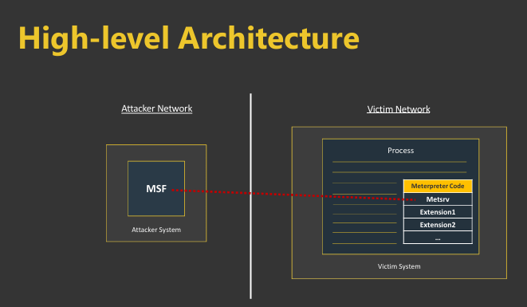
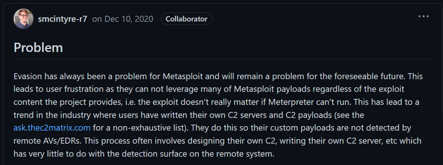
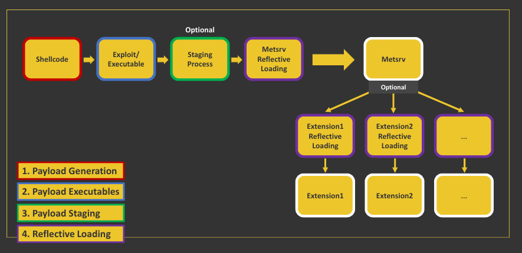

# Introduction
This post walks through the life cycle of a Meterpreter payload—from generation to execution—highlighting its core components, how extensions expand capabilities, and why modern defenses often detect it. We will also clarify key terminology used throughout.
# Components

Windows Meterpreter is primarily built around reflective DLLs—dynamic link libraries that can be loaded directly into memory without touching disk. This in‑memory approach improves stealth and reduces the chance of detection by traditional antivirus.
At the heart of Meterpreter lies its core component, **Metsrv**. This module manages network communications, loads extensions, and coordinates foundational operations. On its own, however, Metsrv offers limited offensive capabilities.
To unlock the full potential of Meterpreter, **extensions** must be loaded. These modules expand functionality—keylogging, screen capture, file system manipulation, and more. Without extensions, Meterpreter is largely a shell with minimal practical use.
# Extensions

Extensions are additional reflective DLLs loaded into the same process to expand a Meterpreter session (no new processes, nothing written to disk). Examples:
- `stdapi`: interact with the OS and file system (cd, ls, netstat, arp, and more)
- `extapi`: WMI and ADSI support; interact with the clipboard and services
- `priv`: privilege escalation to SYSTEM; dump SAM
- `kiwi`: Mimikatz features
- `bofloader`: load COFF/BOF files
# Loading Extensions
Extensions follow the "ext_server_*.dll" naming convention.
- `elevator` is a reflective DLL used by the `priv` extension
- `screenshot` is a reflective DLL used by the `stdapi` extension

Btw—reality check: Meterpreter can be noisy.
Consider:
- Executables generated by Metasploit are often blocked by AVs.
- Meterpreter’s shellcode initialization patterns are detected and blocked by EDRs.
- Even if it runs, memory scans and YARA rules can easily spot a Meterpreter agent in process memory.
When Meterpreter was created, it filled an important need: a post‑exploitation tool better than traditional shells. Over time, defenses improved and priorities shifted.
We face challenges like this:

Nowadays it’s hard to use public tools out‑of‑the‑box (including Meterpreter). Security mechanisms have improved, so the offensive side must adapt.
If your toolset is easily blocked by automated solutions:
- You cannot demonstrate impact.
- You cannot assess efficacy.
- You cannot train and improve security teams.
We can ask clients to temporarily allow tools in some assessments, but that often slows things down. Instead of abandoning Meterpreter, let’s adapt and learn. Even if we end up not using Meterpreter, the lessons will transfer to other tools.
In the next sections, we analyze a Meterpreter payload’s life—from generation to execution.

First, let’s align on a few key concepts and general payload terminology.
# Terminology
## Exploit & Payload
The terms "exploit" and "payload" are often conflated. They are separate:
- Exploit: the process that abuses a vulnerability
- Payload: code that runs after exploitation to achieve specific results
With memory corruption, the payload is typically shellcode (a byte sequence of assembly instructions). For other vulnerability classes, payloads take different forms:
- SQL Injection: SQL that lists database tables
- XSS: JavaScript structured in a specific way
- Broken access control: a specially crafted HTTP request
## In-memory Payload
We focus on scenarios where you can execute code (shellcode) in memory—e.g., MS17‑010, running malicious executables, or post‑exploitation techniques like process injection. Meterpreter and many MSF modules run in memory thanks to reflective DLLs (reflective DLL injection):
- Reflective DLLs are easier to develop than handwritten shellcode
- Similar execution processes can be reused across a reflective DLL toolset

# Reflective DLL Injection
Technique for in‑memory execution of unmanaged/native DLL files (and sometimes EXE files). This is not specific to MSF/Meterpreter. Modern frameworks often implement agents as reflective DLLs (and use reflective PE injection) to help evade security controls.
# Architecture & Data Flow
## Metsrv, TLV, and Transports
- Metsrv: session loop, transport management, and extension loading.
- TLV protocol: Type–Length–Value framing for requests/responses (e.g., stdapi file operations) that works over any transport.
- Transports: TCP and HTTP/HTTPS are common; named pipes/DNS appear via modules. HTTPS provides cover (proxies/CDNs) at a small cost in overhead.
## Extension Model
- Extensions are reflective DLLs loaded by Metsrv to register new TLV endpoints.
- Initialization typically exports a small registration routine that binds commands to handlers.
# Session Lifecycle
## Staged vs. Stageless
- Staged: a minimal loader pulls Metsrv (stage2) over the network; smaller initial artifact but more network indicators and more ways to break.
- Stageless: a single, self‑contained agent; larger artifact but fewer moving parts and often more stable.
## Generation → Delivery → Execution
- Generation: choose OS/arch/transport, staged vs. stageless, C2 profile, and packing/obfuscation.
- Delivery: exploit, phishing, living‑off‑the‑land, or lateral movement.
- Execution: reflective DLL injection, process injection (CreateRemoteThread/APC/Thread Hijack), or child‑process spawn with arguments.
# Reflective Loader Internals (deeper)
Typical steps inside a reflective loader:
- Parse PE headers, allocate image, copy headers/sections; zero‑fill VirtualSize gaps.
- Resolve imports (incl. forwarders); patch IAT; handle delay‑loads when present.
- Apply relocations if not loaded at preferred base.
- Honor TLS callbacks before EntryPoint.
- Set final memory protections per section characteristics (avoid RWX).
- Transfer control to DllMain/WinMain/main as applicable.
# Detection & Evasion Details
- Memory artifacts: RWX regions, IAT anomalies, unbacked executable pages, common API call graphs.
- Hooking/Unhooking: naïve ntdll.dll unhooking can trigger EDR heuristics; consider syscall stubs or clean mappings.
- ETW/AMSI: for native agents, AMSI is less relevant; ETW providers still surface behavior—patching can be fragile and detectable.
- Network indicators: default URIs, user‑agents, and jitter patterns are low‑hanging fruit—customize profiles.
- YARA/Sigma: strings, export names, and section layouts are common signatures; refactor and rename liberally.
# Build & Detection Caveats
- Tooling: Prefer custom loaders over stock msfvenom templates; match x86/x64; strip PDBs.
- OPSEC: Test in an isolated lab; use custom C2 profiles; rotate infra (domains/certs).
- AV/EDR: Recompile and refactor; rename exports/strings; avoid default URIs; add sleep/jitter; consider indirect syscalls where appropriate.
- Memory hygiene: Avoid RWX; set proper section protections; minimize obvious patterns in loaders.
- Ethics: Use only with written authorization; comply with laws and client rules of engagement.