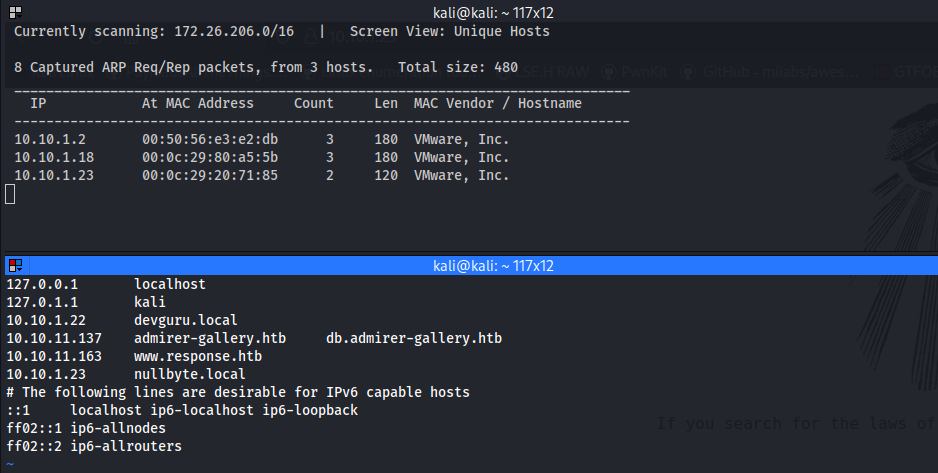

# NullByte

BOX:  `NULLBYTE`

Link: [https://www.vulnhub.com/entry/nullbyte-1,126/](https://www.vulnhub.com/entry/nullbyte-1,126/)

## **TO DO:**

- [x]  Info gathering. Nmap, naabu, nuclei.
- [x]  Exploit:
    - [x]  phpmyadmin exploit
    - [x]  SSH Attack
- [x]  Privilege escalation
- [x]  REPORT
- [x]  Done!

# Information Gathering

## Finding Machine IP + Map VLAN:

Box này nó chưa cho sẵn IP cho nên việc đầu tiên là scan IP và map vlan.



## Port scanning:

Tiếp theo là scan port bằng naabu và nmap.


## Vulns check


## Fuzzing Time

### **Subdomain:**

**Passive:** 


**Active:**


**Hidden directory:**


Trang chủ chỉ có mỗi ảnh gif nên ta tải xuống và dùng binwalk extract xem nội dung HEX thử.


Ta thấy chuỗi string đặc biệt `kzMb5nVYJw` Test thử thì đây chính là đường dẫn tới một trang có form nhập key. 


Ở đây ta dùng Hydra để bruteforce key này


Sau khi nhập key `elite` vào thì web dẫn tới trang như hình.


## **Tổng kết những thông tin useful sau khi scan,fuzzing các kiểu con đà điểu nè:**

| **Scanning** | **PORT** | **Services** | **Version** | **Vuln** | **Exploitable?** | **Note** |
| --- | --- | --- | --- | --- | --- | --- |
| **Naabu  + Nmap** | 80 | Apache httpd | 2.4.10 |  | No |  |
|  | 777 | OpenSSH | 6.7p1 |  | Yes | bruteforce |
|  |  |  |  |  |  |  |
| **Nuclei** |  |  |  |  |  | nothing useful |
| **Fuzzing**  |  | **File/Directory - Domain** |  |  |  |  |
| **Dirsearch** | 80 | `/phpmyadmin` |  |  | Yes |  |
|  | 80 | `/kzMb5nVYJw` |  |  | Yes |  |
| **Subfinder** |  |  |  |  |  | nothing useful |
| **Knock** |  |  |  |  |  | nothing useful |

# **Exploit:**

## **Foothold**


Thử nhập test vào ô username và enter. Nhìn vào url ta thấy nó hiện ra parameter có dạng như sau:

 `?<tenbien> = <giatrinhapvaoform>` 


Ta thay đổi vài giá trị khác vào parameter `usrtosearch` kết quả vẫn trả về `Fetched data successfully` .

⇒ Ta có thể đoán được parameter trên dùng để query thông tin username trong database rồi trả về  cho ta. 

### Giả thiết

Ta có câu lệnh query như này: `Select * from users where username=”$usrtosearch”`

Vậy giờ sẽ ra sao nếu ta thử nhập vào một ký tự `‘` 

⇒ Lúc này câu lệnh query sẽ trông như thế này: `Select * from users where username=”'”`

⇒ Expected: Câu lệnh này sẽ báo lỗi sai cú pháp.

### Thực hiện

Và đây chính là kết quả sau khi thực hiện.  


### Kết luận

Ta có thể thấy server trả về lỗi syntax. ⇒ Đúng như ta mong đợi đến đây ta có thể kết luận rằng trang này đã bị dính SQLi.

Vậy bước tiếp theo là dùng Sqlmap để dump database . Với các payload như  sau: 

`Payload`

```bash
sqlmap --url="[http://nullbyte.local/kzMb5nVYJw/420search.php?usrtosearch=](http://nullbyte.local/kzMb5nVYJw/420search.php?usrtosearch=)" -dump

sqlmap --url="[http://nullbyte.local/kzMb5nVYJw/420search.php?usrtosearch=](http://nullbyte.local/kzMb5nVYJw/420search.php?usrtosearch=)" —dbs
```

Ta có kết quả là dump được các bảng trong database của trang.


Ta thử đăng nhập trang **phpmyadmin** tài khoản username `root` với password `sunnyvale` để đăng nhập thành công.


Ta thấy trong database có username `ramses`  với password được mã hoá. D0oán được đây chính là một trong những user trên server. Ở đây thay vì chọn cách giải mã password thì ta dùng hydra để bruteforce nó.


Bruteforce thành công!! Ta có password cho user `ramses` là `omega.`


Đăng nhập SSH thành công.


# Privilege Escaslation:

## Enum:

Đầu tiên, ta check nội dung file `.bash_history`  xem lịch sử thực thi command xem có manh mối gì không!!!  


Ở đây ta thấy có command chạy file `procwatch` tại đường dẫn `/var/www/backup` . Vào xem thử:


Thì thấy trong nội dung file giống như 1 bản ghi lại process( như trong ảnh có 3 process là procwatch, sh và ps ). Và check thử thì thấy đây là một file SUID ⇒ Ta có thể lợi dụng file này để khai thác leo thang đặc quyền.

## Exploit:

Ta copy file /bin/sh và đổi tên thành ps và để cùng thư mục với file `procwatch` kia. Chạy lại file `procwatch` và BUMP!! Got it!!!


# Now you pwned everything!!! It’s your time to play with the victim.

# End game!!!

# PS:

Nguồn tham khảo:

[https://www.linuxfordevices.com/tutorials/linux/hydra-brute-force-ssh](https://www.linuxfordevices.com/tutorials/linux/hydra-brute-force-ssh)