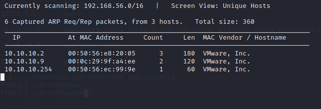

# Photographer|

BOX: Photographer

Link: [https://www.vulnhub.com/entry/photographer-1,519/](https://www.vulnhub.com/entry/photographer-1,519/)

## **TO DO:**

- [x]  Info gathering. Nmap, nikto
- [x]  Exploit:
    - [x]  SMBCLIENT [//10.10.10.9/sambashare](notion://10.10.10.9/sambashare)
    - [x]  Login /admin page
    - [x]  Shell uploaded
    - [x]  Get Shell
- [x]  Privilege escalation: SUID
- [x]  REPORT
- [x]  Done!

## Info gathering:

Scan network để tìm ra IP của box.



IP Box là: 10.10.10.9. Map local dns cho tiện.


Ta chạy nmap và nikto xem thử:


Enum4linux:


Cho chạy fuzz nè:


Cho chạy fuzz tiếp trên port 8000


Check các file và các directory ta thấy có /admin có thể useful


## Tổng kết những thông tin useful sau khi chạy fuzz nmap nikto các kiểu con đà điểu nè:

|  | **PORT** | **Services** | **Version** | **Vuln** | **Exploitable**? | Notes |
| --- | --- | --- | --- | --- | --- | --- |
| **Nmap** | 80 | http | Apache httpd 2.4.18 | CVE 2019-0211 | Yes | Sẽ thử exploit theo cách này sau.                                                                               Link exploit: [https://www.exploit-db.com/exploits/46676](https://www.exploit-db.com/exploits/46676) |
|  | 139 | netbios-ssn | Samba smbd 3.X - 4.X (workgroup: WORKGROUP) |  | No |  |
|  | 445 | netbios-ssn | Samba smbd 4.3.11-Ubuntu (workgroup: WORKGROUP) |  | No |  |
|  | 8000 | http | Apache httpd 2.4.18 | CVE 2019-0211 | Yes |  |
| **Nikto** | nothing useful here |  |  |  | No |  |
| **Enum4linux** |  | SMB |  | [//10.10.10.9/sambashare](notion://10.10.10.9/sambashare)  | Yes |  |
|  | **PORT** | **File/Directory** | **Exploitable ?**  |  |  |  |
| **FUZZING** | 80 | nothing useful | No |  |  |  |
|  | 8000 | /admin | Yes |  |  |  |
|  |  |  |  |  |  |  |

## **Exploit:**

Trước hết check smb share thử xem coi có gì đặc biệt hong.


Khi connect vào bằng smbclient thì ta thấy một file txt. Mở ra đọc thì ta thấy đây là nội dung của 1 email, dựa vào nội dung email này thì mình đoán được username && password như sau: 

`username = [daisa@photographer.com](mailto:daisa@photographer.com)`

`password = babygirl`


Ở trên ta check được form login admin dashboard(/admin) thử điền username&&password này vào thử thì thấy nó work. Ok fine!!! 

**login admin page**

Theo kinh nghiệm của mình thì khi gặp các admin dashboard như này thì việc đầu tiên là check xem có chức năng upload không, nếu có thì tìm cách up shell(bypass filter nếu có). Khá may mắn là ở machine này chỉ filter mấy file hình ảnh cho nên mình dễ dàng bypass bằng cách đổi đuôi file bằng bủhsuite , gòi chỉ việc up lên ròi chiến hoiiii :<.

 Shell upload:

Shell: [https://raw.githubusercontent.com/pentestmonkey/php-reverse-shell/master/php-reverse-shell.php](https://raw.githubusercontent.com/pentestmonkey/php-reverse-shell/master/php-reverse-shell.php)


## Privilege escalation:

Get root by SUID

Ta check thấy file php này có SUID:


Get Flag! Enjoy ! !! 


## PS:

Linux privileges:

SUID :

- Tìm files có SUID:
    - cmd: find / -perm -u=s -type f 2>/dev/null
- Privileges
    - Khi SUID được gán cho lệnh copy.
        - Ta copy file etc/passwd về máy.
        - Tạo một user mới có quyền root bằng openssl . Cmd: openssl passwd -1 -salt [salt value] {password}.
        - Rồi thêm vào file cuối file passwd ở trên.
        - Upload lại file passwd lên target vào folder /tmp/ xong ghi đè vào file passwd của target.
        - cmd: su . Get root !!!
    - Khi SUID được gán cho lệnh find.
    - Khi SUID được gán cho vim
    - Khác: Ví dụ ở bài trên thì ta check thấy SUID được gán cho file excute php7.2 thì chỉ cần tạo ra 1 bản copy của shell rồi ghi đè lên bỏ qua flag -p đi là get root được.
        - cmd :
        
        ```bash
        CMD="/bin/sh"
        php -r "pcntl_exec('/bin/sh', ['-p']);"
        ```