# BOF
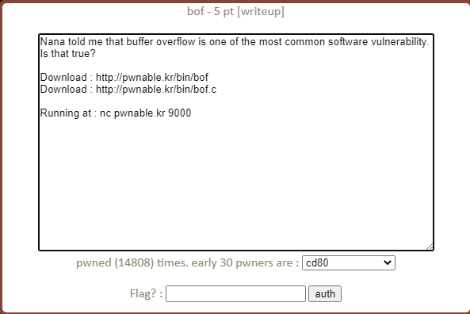
Bài này cho ta cả source code C khá là tiện khỏi tốn công RE. Bây giờ ta bắt tay vào phân tích code thôi nào.
## Code analyst
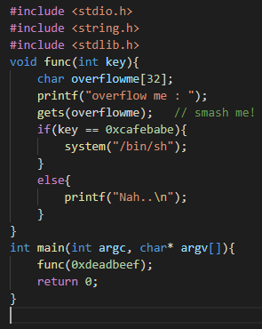
Ta thấy chương trình này chỉ cho ta nhập vào biến overflowme bằng hàm gets. Mà hàm này có đặc điểm là không giới hạn số kí tự nhập vào cho nên mình có thể tận dụng để khai thác lỗi buffer overflow. Tiếp theo mình thấy chương trình sẽ so sánh key (0xdeadbeef) được truyền vào hàm func với 0xcafebabe nếu đúng thì ta lấy được shell.  
## Examining the Binary, Exploitation
Giờ ta chạy chương trình thử.
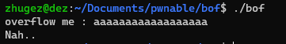
Alright! Mọi thứ diễn ra đúng như ta phân tích code. Giờ bỏ vào gdb debug thôi 😄
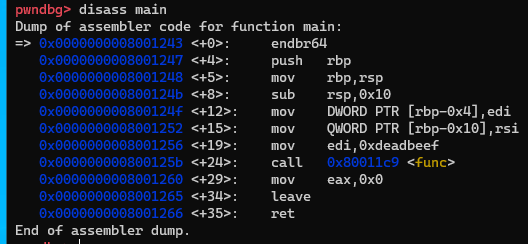
Ta disassemble xem hàm func  thử.
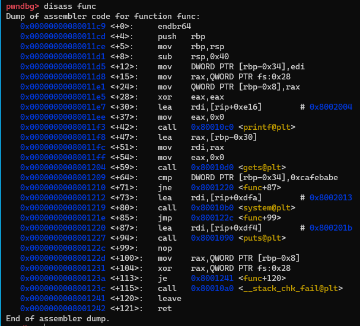

Ta cần đặt 2 breakpoint: 1 tại hàm gets để lấy địa chỉ của vùng nhớ lưu giá trị ta nhập vào, 1 tại hàm cmp để xem cấu trúc so sánh của chương trình. Chạy chương trình lên nào.
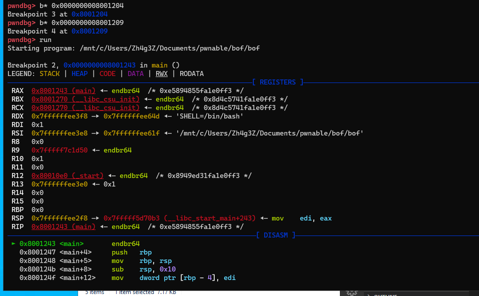
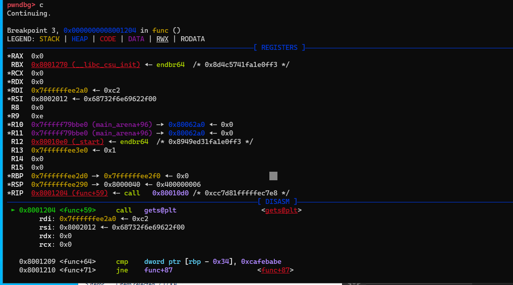
Ta thấy 0x7ffffffee2a0 chính là địa chỉ vùng nhớ lưu giá trị ta nhập vào.
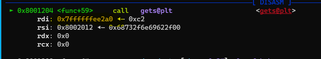
Tiếp đến xem thử hàm cmp. Ở đây ta thấy chương trình sẽ so sánh rbp-0x34 với 0xcafebabe

Ta lấy địa chỉ vùng nhớ so sánh:

Ta xem giá trị ở vùng nhớ này bằng lệnh x/x 0x7ffffffee29c
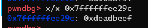
Ta thấy tại đây chính là giá trị mà chương trình đã truyền vào hàm func() -> Chương trình này so sánh chuỗi truyền vào hàm func() với 0xcafebabe.

=> Vậy nhiệm vụ của mình bây giờ chính là làm sao thay đổi giá trị tại địa chỉ này ( 0x7ffffffee29c) từ 0xdeadbeef thành 0xcafebabe là ta win.

Ta có thể tính được khoảng cách từ địa chỉ vùng nhớ so sánh(0xdeadbeef) tới địa chỉ thanh ghi rbp là 0x34 (do cmp = $rbp-0x34). 
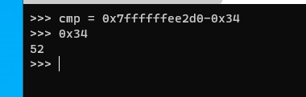
Mà địa chỉ thanh ghi rbp cũng chính là địa chỉ vùng nhớ lưu giá trị ta nhập vào. Vậy giờ ta chỉ việc ghi đè 0xcafebabe lên vùng nhớ này.

Ta sẽ có payload như sau: `"v"*52+0xcafebabe`.
Giờ đi viết code exploit thôi nào.
## Writing an Exploit with pwntools 
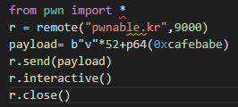
Và đây chính là thành quả: 
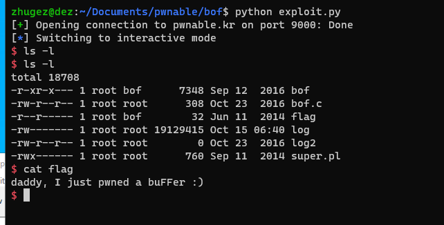
## Kết luận: 
Ở bài này ta t Ta chỉ cần tìm ra được địa chỉ của vùng nhớ lưu giá trị nhập vào và địa chỉ của vùng nhớ so sánh với chuỗi cho trước. Rồi tận dụng lỗi buffer overflow của hàm gets() để ghi đè chuỗi cho trước vào => bypass điều kiện -> win 👏