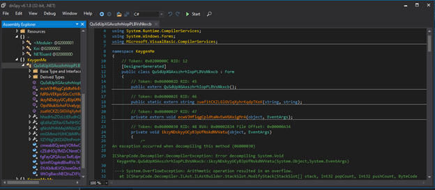

Bài này đề yêu cầu ta tìm key đúng với username "Root-Me".
Đầu tiên check thử thì đây là file code bằng .Net và 32 bit.

Bỏ vào dnspy coi code thử thôi nào ^^:

Ta có thể dễ dàng nhận ra file này đã bị obfuscated.
Vậy bước tiếp theo ta tìm thử xem coi nó được obfuscated bằng cách nào. Ở đây mình đã thử dùng confuserEx Unpack với de4dot nhưng đều bị fail. Lúc này mình quan sát kĩ lại từng dòng code trong dnspy xem có bỏ sót 1 điều gì không ^^ và Ôi!Thật  bất ngờ  . Đây là cái mình nhìn thấy và nó cũng chính là cái keyword để deobfuscated.

Search Google thì mình tìm được 1 video hướng dẫn deobfuscated dạng này. Mình sẽ để link ở dưới.
Link: https://www.youtube.com/watch?v=2vPo1XpQh0I

Làm theo video ta deobfucate được code tuy là chưa clean lắm nhưng có thể đọc được.

Đọc code ta thấy chương trình có 1 hàm check để anti- debug ở đây mình chỉ cần xóa hàm close().

Vậy là ta đã bypass được anti-debug. Bây giờ đọc qua hàm check key xem. Ở đây ta có thể thấy key ta nhập vào sẽ được so sánh với flag được mã hóa bằng base64. Với flag = 1 đoạn mã base64 xor với string cho trước.

Ở đây mình sử dụng python để giải bài này. Dưới đây là đoạn code(Mình sẽ để đính kèm file .py):
```python
import base64

def encode(s1, s2):  # Mo phong lai ham encode string

    return ''.join(chr(ord(a) ^ ord(b)) for a, b in zip(s1, s2))

def getFlag():

    user = "Root-me"
    txt = base64.b64encode(bytes(user.encode())).decode('utf-8')[0:5]

    baseString = "s0h4rd"
    valstr1 = "dr4h0s"
    valstr2 = "dr4h0sv2"

    # value encode(user,valstr) -> chuyen thanh bytes -> covert to base64
    value1 = base64.b64encode(bytes(encode("".join(list(reversed(txt[0:5]))), valstr1).encode())).decode('utf-8')[0:5]
    value2 = base64.b64encode(bytes(encode("".join(list(txt[0:5])), valstr2).encode())).decode('utf-8')[0:5]

    flag = []
    flag.append(encode(base64.b64decode("BQ==").decode("utf-8"), baseString))
    flag.append(encode(base64.b64decode("QA==").decode("utf-8"), baseString))
    flag.append(encode(base64.b64decode("AQ==").decode("utf-8"), baseString))
    flag.append(encode(base64.b64decode("Cg==").decode("utf-8"), baseString))
    flag.append(encode(base64.b64decode("LA==").decode("utf-8"), baseString))

    for i in range(0, 5):
        flag.append(value1[i])

    flag.append(encode(base64.b64decode("LA==").decode("utf-8"), baseString))
    flag.append(encode(base64.b64decode("Gw==").decode("utf-8"), baseString))
    flag.append(encode(base64.b64decode("Rw==").decode("utf-8"), baseString))
    flag.append(encode(base64.b64decode("AQ==").decode("utf-8"), baseString))
    flag.append(encode(base64.b64decode("Fw==").decode("utf-8"), baseString))
    flag.append(encode(base64.b64decode("EA==").decode("utf-8"), baseString))
    flag.append(encode(base64.b64decode("Qw==").decode("utf-8"), baseString))
    flag.append(encode(base64.b64decode("AQ==").decode("utf-8"), baseString))
    flag.append(encode(base64.b64decode("QA==").decode("utf-8"), baseString))
    flag.append(encode(base64.b64decode("LA==").decode("utf-8"), baseString))

    for i in range(0, 5):
        flag.append(value2[i])

    flag.append(encode(base64.b64decode("LA==").decode("utf-8"), baseString))
    flag.append(encode(base64.b64decode("GA==").decode("utf-8"), baseString))
    flag.append(encode(base64.b64decode("QA==").decode("utf-8"), baseString))
    flag.append(encode(base64.b64decode("Cg==").decode("utf-8"), baseString))
    flag.append(encode(base64.b64decode("FA==").decode("utf-8"), baseString))
    flag.append(encode(base64.b64decode("QA==").decode("utf-8"), baseString))
    flag.append(encode(base64.b64decode("HQ==").decode("utf-8"), baseString))
    return flag

def main():
    print("Hello welcome to Zhuge's World! This Root-Me PE .Net keygenme challenge.")
    print("Flag: " + "".join(getFlag()))
if __name__ == "__main__":
    main()
```
Và đây là thành quả:

Check lại thử:

Vậy là cuối cùng ta đã giải bài này thành công rồi. Cảm ơn các bạn đã đọc hết bài writeup của mình ^^.
Thử submit thì mình thấy root-me lại báo sai. Thử đổi vị trí value lại xem sao. Và amazing! mình đã submit được flag.
**Flag**: *v3ry_MR8NH_h4rdc0r3_AAQNB_k3yg3n*