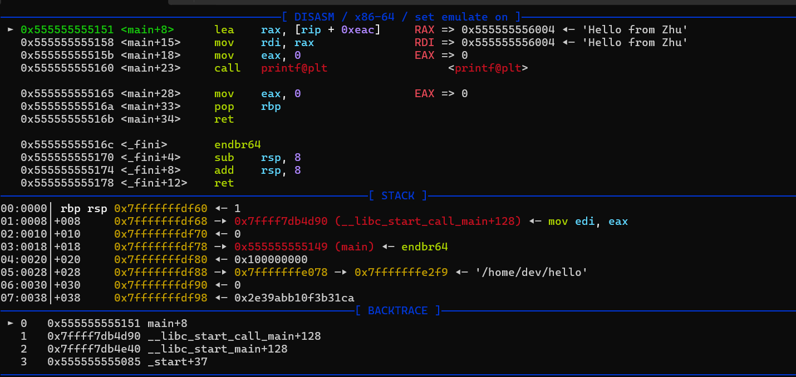
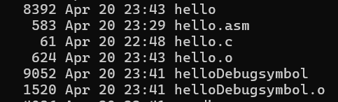
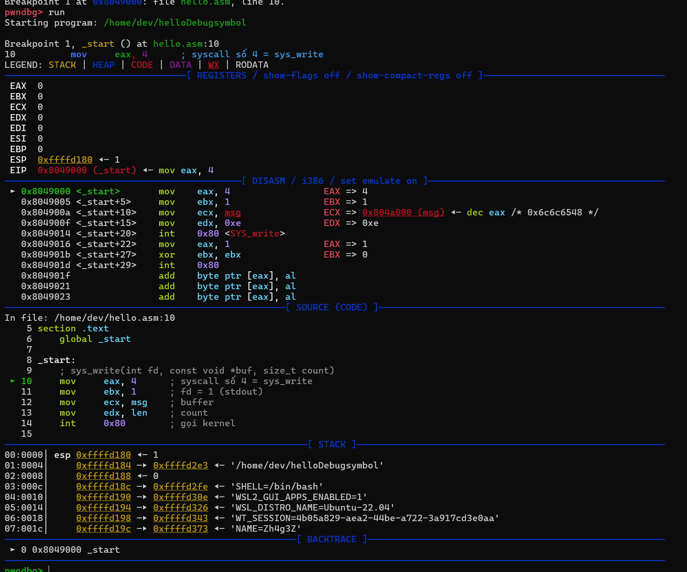
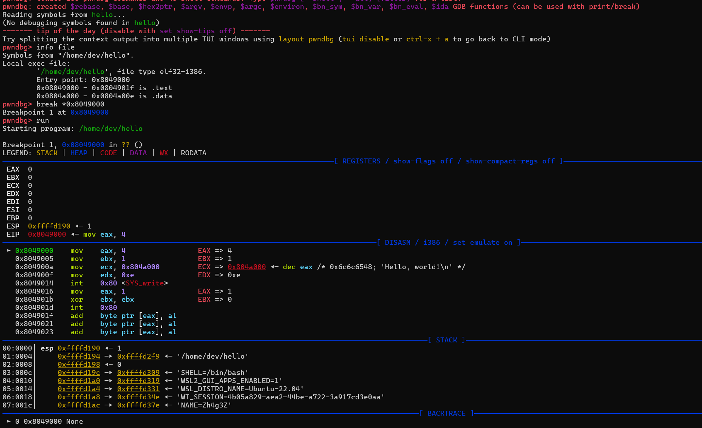
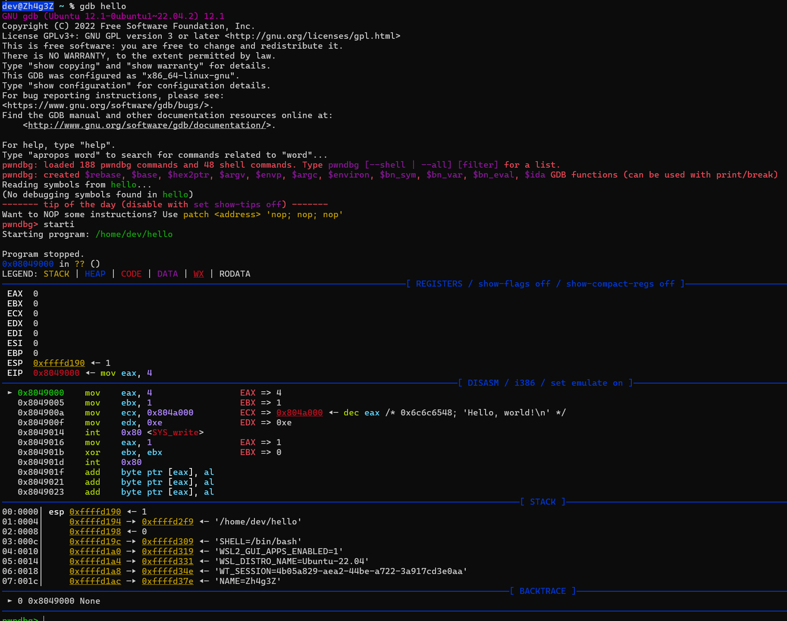

*(Viết cho Ubuntu 22.04, GDB ≥ 11, NASM 2.16 trở lên – các bản khác chỉ cần thay lệnh link cho phù hợp)*---

# 1. NASM là gì?
NASM (Netwide Assembler) là một trình biên dịch Assembly mã mở, đa nền tảng, dùng cú pháp Intel rõ ràng và rất linh hoạt trong việc định nghĩa macro, nhãn và section (`.data`, `.bss`, `.text`). So với MASM (Microsoft Macro Assembler) – vốn chỉ chạy trên Windows và tích hợp chặt với Visual Studio, hỗ trợ nhiều chỉ thị “cao cấp” (như TYPEDEF, PROC/ENDP) – NASM nhẹ hơn và dễ mang sang Linux, macOS hay BSD. Còn GAS (GNU Assembler) trong bộ Binutils mặc định dùng cú pháp AT&T (thuộc dạng `movl %eax, %ebx`), đôi khi gây khó khăn với người quen Intel syntax; tuy nhiên GAS gắn chặt với toolchain GCC và hỗ trợ inline assembly trực tiếp trong C/C++. Trong khi đó TASM hay FASM cũng là trình assembler có khả năng tối ưu cao và macro mạnh, nhưng ít được duy trì và ít cộng đồng hơn so với NASM.  

Về khả năng tương tác với hệ điều hành, NASM cho phép chúng ta tự do chọn cách gọi system call (dùng `int 0x80` hoặc `syscall`), trong khi MASM thường dùng WinAPI (Invoke ExitProcess, WriteFile…). Với GAS, chúng ta sẽ gắn trực tiếp các symbol do GCC sinh ra. Cuối cùng, so với các ngôn ngữ bậc cao như C, việc viết NASM đòi hỏi quản lý thủ công thanh ghi, bộ nhớ và cờ CPU, nhưng đổi lại chúng ta có toàn quyền tối ưu hóa từng chu kỳ lệnh, tiết kiệm bộ nhớ và hiểu sâu về cách CPU vận hành—mà C hay các ngôn ngữ khác không thể hiện chi tiết đến vậy.


# 2. Vì sao nên dùng Pwndbg thay vì GDB “thuần” khi debug ASM?

* **Bố cục 4‑pane** (regs | stack | disasm | source) tô màu, giúp chúng ta “nhìn phát hiểu” luồng thực thi.  
* Lệnh **`context`** tự cập nhật khi chúng ta `stepi` – không cần gõ `info r`, `x/5i $eip` liên tục.  
* Thao tác **địa chỉ tuyệt đối** (bộ nhớ, stack) cực nhanh nhờ alias như `tel`, `hexdump`, `vmmap`.  
* Hỗ trợ cả **dwarf** lẫn **stabs** nên NASM + `-g` hoạt động trơn tru.
# 3. Build có Debug Info và không có Debug Info
Ta build 1 chương trình assembly x86 như sau:

```nasm
section .data
    msg     db  "Hello, world!", 0xA   ; chuỗi + newline
    len     equ $ - msg                ; tính độ dài

section .text
    global _start

_start:
    ; sys_write(int fd, const void *buf, size_t count)
    mov     eax, 4      ; syscall số 4 = sys_write
    mov     ebx, 1      ; fd = 1 (stdout)
    mov     ecx, msg    ; buffer
    mov     edx, len    ; count
    int     0x80        ; gọi kernel

    ; sys_exit(int status)
    mov     eax, 1      ; syscall số 1 = sys_exit
    xor     ebx, ebx    ; status = 0
    int     0x80        ; gọi kernel
```
## Khi có debug info(debug-symbol) (-g, DWARF/STABS)
Với cú pháp lệnh build với debug-symbol và link tạo binary như sau:
```nasm
nasm -f elf -g -F dwarf hello.asm -o helloDebugsymbol.o
ld -m elf_i386 -o helloDebugsymbol helloDebugsymbol.o
```
* Breakpoint theo nguồn: chúng ta có thể đặt breakpoint ngay tại tên hàm hoặc số dòng trong file .c/.asm (ví dụ: break main.c:42 hoặc break _start).
* Hiển thị code bên cạnh disassembly: Pwndbg sẽ đồng bộ hiển thị cả source code và opcode, giúp chúng ta nắm được luồng thực thi tức thì.
* Thông tin biến và kiểu dữ liệu: chúng ta có thể dùng print counter hoặc print struct_point.x để xem giá trị đúng tên biến chứ không phải đọc raw memory.
* Call stack rõ ràng: Lệnh backtrace liệt kê chuỗi hàm kèm tham số, giá trị biến local và frame pointer chính xác.

* Kích thước file lớn hơn: Thêm các section .debug_* (hoặc .stab), có thể strip riêng khi release với objcopy --strip-debug.



## Khi không có debug info (bỏ -g, hoặc dùng -s)
```nasm
nasm -f elf hello.asm -o hello.o
ld -m elf_i386 -s -o hello hello.o
```
* Breakpoint theo địa chỉ: Chỉ có thể dùng break *0x8049000, không thể break theo tên hàm hay số dòng.
* Chỉ disassembly: chúng ta chỉ thấy opcode và địa chỉ, không có source code hiển thị kèm.
* Biến bị strip: Không thể print var_name; mọi thứ phải đọc qua x/4wx hoặc manual cast pointer.
* Call stack hạn chế: backtrace chỉ trả về địa chỉ và offset, rất khó theo dõi luồng gọi.
* File nhẹ hơn: Thích hợp cho release, không lộ metadata, dung lượng nhỏ hơn. 

* Lưu ý: Khi không có debug info, chúng sẽ debug “mù” source. Hãy tận dụng Pwndbg để:
    * Tự động format disassembly, highlight registers.
    * Search pattern và gadget nhanh.
    * Telescope stack để xem layout.
    * Vmmap/piebase để xử lý PIE.


> **Tip**: Dù không có symbol, Pwndbg vẫn hỗ trợ context disasm stack regs, search --string "Hello", telescope $esp để điều hướng nhanh hơn GDB thuần.

# 4. DWARF và STABS – Hai “Ngôn ngữ” Của Debugger
Khi biên dịch mã với tùy chọn -g, NASM có thể chèn thông tin gỡ lỗi theo hai chuẩn chính: DWARF (hiện đại) và STABS (cổ điển). Về cơ bản, cả hai đều giúp GDB/Pwndbg “hiểu” được mối quan hệ giữa địa chỉ máy (opcode) và vị trí trong file nguồn, nhưng khác nhau ở mức độ phong phú và khả năng mở rộng:
#### DWARF
* Chia nhỏ vào các section như .debug_info, .debug_line, .debug_abbrev… nên dễ quản lý và mở rộng (hãy nghĩ tới việc hiển thị inlined function, macro, template, struct phức tạp).
* Là chuẩn mặc định của GCC/Clang, được các công cụ hiện đại (IDE, profiler, sanitizers…) ưu tiên hỗ trợ.
* Dung lượng file debug lớn hơn STABS nhưng có thể strip hoặc compress tách riêng khi đóng gói release.

#### STABS
* Ra đời từ kỷ nguyên UNIX 32‑bit, vẫn được dùng trong các toolchain cũ hoặc kernel module legacy.
* Gom thông tin vào .stab/.stabstr với cấu trúc đơn giản, chỉ đủ để map tên hàm, biến, số dòng; ít metadata hơn DWARF.
* File .o thường nhỏ hơn, nhưng gần như không thể mở rộng để lưu thêm thông tin hiện đại (ví dụ inline call hay macro expansion).
* Tóm lại, với hầu hết workflow ngày nay – đặc biệt khi chúng ta cần debug kết hợp C và ASM hoặc theo dõi macro/inline– thì DWARF là lựa chọn ưu việt, còn STABS chỉ dành cho các dự án cực kỳ cổ hoặc môi trường toolchain bị giới hạn.
# 5. Chuẩn bị môi trường  

```bash
# 1. Cài pwndbg
git clone https://github.com/pwndbg/pwndbg ~/tools/pwndbg
cd ~/tools/pwndbg && ./setup.sh

# 2. Cài nasm (nếu chưa có)
sudo apt install nasm
```

# 6. Khởi động Pwndbg  

```bash
gdb ./hello        # Pwndbg tự nạp qua ~/.gdbinit
starti             # dừng ngay lệnh đầu
```

chúng ta sẽ thấy:



### 5. Quy trình debug NASM “chuẩn bài”  

| Bước | Lệnh & ý nghĩa |
|------|----------------|
| 1. Xem toàn cảnh | `context` (hoặc `context regs disasm`) |
| 2. Bước từng lệnh | `stepi` (`si`), `nexti` (`ni`) |
| 3. Theo dõi thanh ghi quan trọng | `reg eax edi esi edx` |
| 4. Soi stack | `telescope $esp` (`tel`) |
| 5. Xem ô nhớ bất kỳ | `x/10wx 0x404000` (16 byte word) |
| 6. Đặt breakpoint vào nhãn | `break _start+5` **hoặc** `break *0x40100b` |
| 7. Đổi theme dark/light | `theme context.theme dark` |
| 8. Ghi macro lặp bước | `define stepx\nsi\ncontext\nend` |

... Continue

Hy vọng qua bài blog này có thể giúp chúng ta debug  “nhanh như gió”, *snipe* bug chuẩn từng thanh ghi!